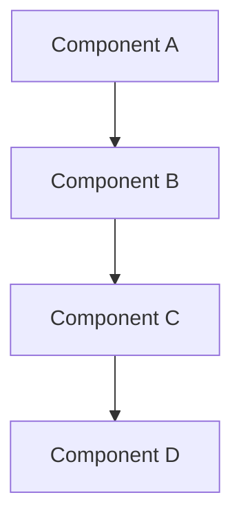

# [Title]

Overview text...

## Features

The [Module Name] module offers the following features:

- **Feature 1**: Description of feature 1.
- **Feature 2**: Description of feature 2.
- **Feature 3**: Description of feature 3.

## Dependencies

The [Module Name] module depends on the following modules:

- **Dependency 1**: Description of dependency 1.
- **Dependency 2**: Description of dependency 2.

It also relies on the following crates:

- [Crate 1](https://link.to/crate1): Description of crate 1.
- [Crate 2](https://link.to/crate2): Description of crate 2.

## Architecture

Description of the architecture...

## Known limitations

The [Module Name] module has the following known limitations:

- **Limitation 1**: Description of limitation 1.
- **Limitation 2**: Description of limitation 2.

## Future improvements

Planned future improvements for the [Module Name] module include:

- **Improvement 1**: Description of improvement 1.
- **Improvement 2**: Description of improvement 2.

## References

- **Related Topic 1**: Link to related internal documentation.
- **Related Topic 2**: Link to related internal documentation.

## See also

- [Additional Resource 1](https://link.to/resource1)
- [Additional Resource 2](https://link.to/resource2)
