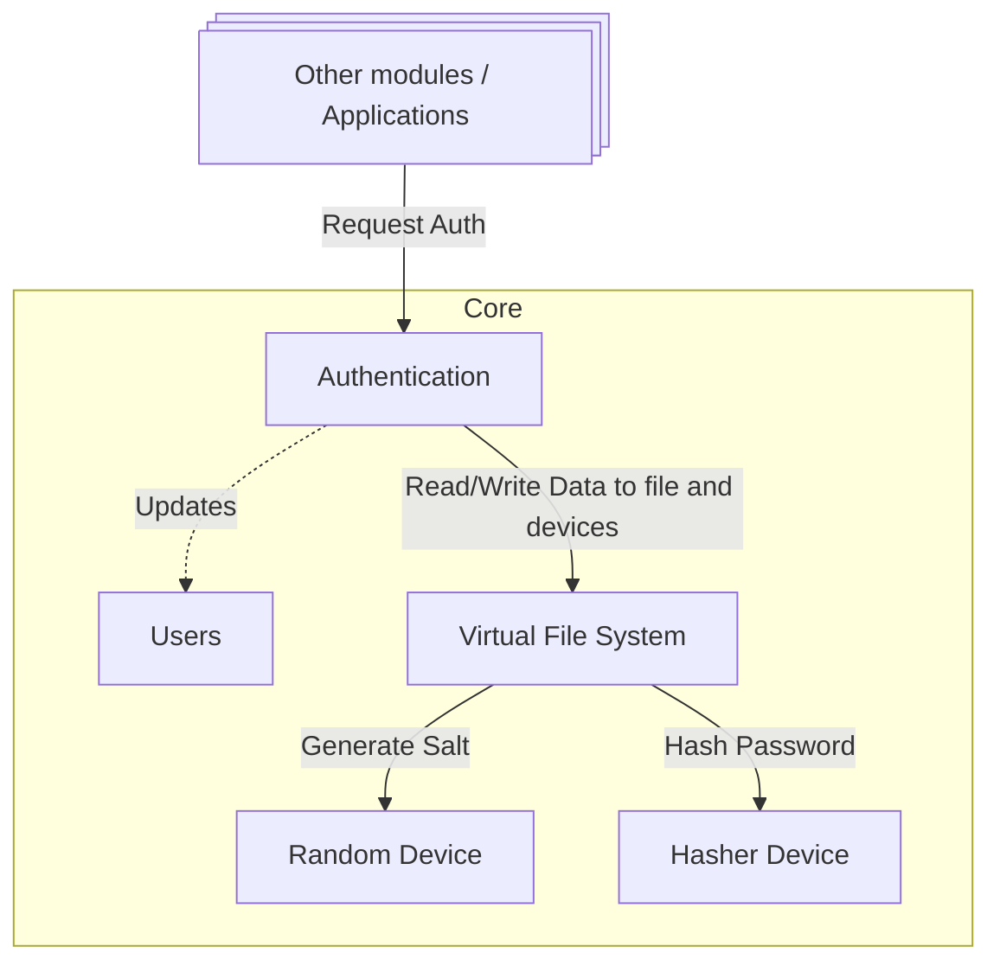

# 🔒 Authentication

The **Authentication** crate provides user authentication and management functionalities for Xila. It enables secure access control mechanisms, ensuring that only authorized users can access sensitive data or perform privileged actions.

## Features

- **User Management**: Handles creation, modification, and deletion of user accounts and groups. Unlike the [Users](../modules/users.md) module which manages runtime user sessions, this crate handles the persistent storage of user data.
- **Secure Authentication**: Verification of user credentials using salted password hashing.
- **Data Persistence**: Serialization and storage of user and group information on the file system.

## Architecture

The Authentication crate serves as the bridge between the system's security requirements and the underlying storage and hardware capabilities.

### Password Hashing

To secure user passwords, the module employs a salt-based hashing strategy:

1.  **Salt Generation**: A random salt is generated using the [Device](./device.md) crate's interface to the random number generator.
2.  **Hashing**: The plaintext password is combined with the salt and processed by the SHA-512 algorithm via the hashing device.
3.  **Verification**: During login, the stored salt is retrieved and combined with the input password. The result is hashed and compared against the stored hash.

### Data Storage

User and group data are serialized into JSON format using the <ExternalReference crate="miniserde" /> crate.

- **Users**: Stored in `/system/users/{username}.json`.
- **Groups**: Stored in `/system/groups/{groupname}.json`.

## Dependencies

### Internal Crates & Modules

- [File System](./file_system.md): Provides the underlying storage driver interfaces.
- [Device](./device.md): Provides access to hardware accelerators for hashing (`/devices/hasher`) and random number generation (`/devices/random`).
- [Users](../modules/users.md): The runtime representation of users and groups. The Authentication crate loads persistent data into the Users module.
- [Virtual File System](../modules/virtual_file_system.md): Used to perform file operations for storing and retrieving account data.

### External Dependencies

- **<ExternalReference crate="miniserde" />**: A lightweight library for serializing and deserializing JSON data.

## Limitations

- **Algorithm Support**: Currently, only **SHA-512** is used by default. While secure, modern best practices often recommend memory-hard functions like Argon2 or bcrypt to resist hardware-accelerated brute-force attacks. Future updates may introduce pluggable hashing algorithms depending on hardware capabilities.

## See Also

- [Users Module](../modules/users.md)
- <HostReference crate="authentication" />
