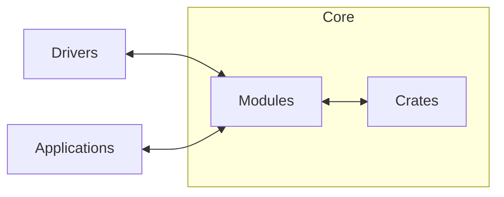

# 📐 Architecture

Xila is designed with modularity and portability in mind. It is built to run on a variety of platforms, from embedded systems to desktop computers, and even in web browsers via WebAssembly (WASM).

- [Drivers](./drivers/): Xila supports a wide range of hardware drivers, allowing it to interface with various peripherals and devices.
- [Crates](./crates/): Internal libraries, or "crates", provide essential functionalities that can be leveraged by modules and applications.
- [Modules](./modules/): A special category of crates that are stateful and singleton, providing core services and functionalities to the operating system.
- [Executables](./executables/): User programs that run on top of Xila, either as native binaries or as WASM modules.

Xila itself is implemented as a library, which means that applications can directly link against it. This design choice allows for greater flexibility and ease of use, as developers can build applications that leverage Xila's capabilities without the need for a traditional operating system layer.

It's only in the end binary that Core, Drivers and Applications are assembled together to create a complete system.
