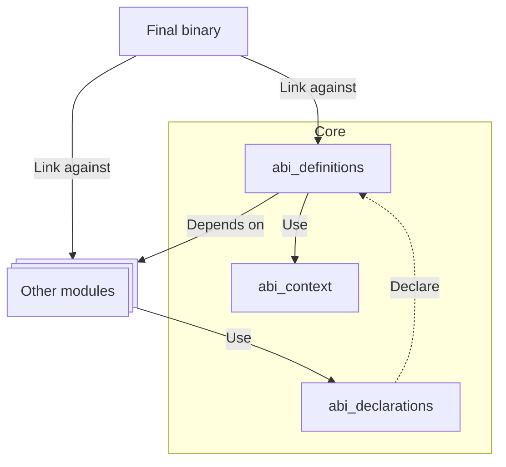

# 🔗 ABI

Although Xila is written in Rust, it provides a C-compatible Application Binary Interface (ABI) to enable interoperability with C and other languages that can interface with C.
This facilitates integrating Xila with existing C libraries and developing applications in languages without direct Rust support.

The ABI is utilized by:

- The [Virtual machine](./virtual_machine.md) module to expose the system interface.
- The [Graphics](./graphics.md) module to provide the C-style interface expected by LVGL.

## Motivation

The primary reasons for providing a C-compatible ABI are:

- **Interoperability**: Given C's widespread use, a C-compatible ABI allows Xila to interface with a vast ecosystem of existing libraries and applications.
- **Stability**: Unlike Rust's ABI, the C ABI is stable and does not change between compiler versions. This ensures that applications built against a specific version of Xila remain compatible with future versions (provided the ABI definition itself remains compatible).

## Capabilities

Currently, the ABI exposes the following functionalities:

- **Task management** (proxies the [Task](./task.md) module): Creation, deletion, synchronization primitives (semaphores, mutexes, etc.), and scheduling.
- **File operations** (proxies the [Virtual File System](./virtual_file_system.md) module): File manipulation and file system management.
- **Memory management** (proxies the [Memory](./memory.md) module): Memory allocation and deallocation.
- **Time management** (proxies the [Time](./time.md) module): Time retrieval, setting, timers, and delays.
- **Standard library functions**: Basic C standard library functions such as `memcpy`, `memset`, `strcmp`, etc.

## Architecture

The ABI module is implemented across three internal crates to ensure modularity and proper linkage:

- <HostReference crate="abi_declarations" />
  : Declares the functions and methods exposed through the ABI. It uses [cbindgen](https://github.com/eqrion/cbindgen) to generate the C header file `xila.generated.h`.
- <HostReference crate="abi_definitions" />
  : Defines the C-compatible data structures and types used in the ABI.
- <HostReference crate="abi_context" />
  : Manages the context and state required for ABI operations.

The separation of declarations and definitions helps prevent multiple symbol definitions during linking, addressing differences in how Rust handles `#[no_mangle]` symbols compared to standard Rust symbols.

## Dependencies

The ABI module depends on the following Xila modules:

- [Virtual File System](./virtual_file_system.md): For file operations.
- [Task](./task.md): For task metadata retrieval.
- [Log](./log.md): For logging ABI-related events and errors.

It also relies on the following internal crates:

- [Synchronization](../crates/synchronization.md): For thread-safe operations within the ABI.
- [File System](../crates/file_system.md): For file system primitives used by the VFS module.

## Known Limitations

- **Limited Coverage**: Only a subset of Xila's core functionalities is currently exposed through the ABI.
- **Performance Overhead**: Calling functions through the C ABI introduces overhead compared to native Rust calls. This is due to data conversion, pointer/identifier translation, and calling convention differences.

## Future Improvements

- **Expand Coverage**: Gradually expose more Xila functionalities to provide a comprehensive C interface.
- **Optimize Performance**: Implement optimizations to minimize overhead, such as reducing data conversions and improving calling conventions.

## References

- <HostReference crate="abi_context" />
- <HostReference crate="abi_declarations" />
- <HostReference crate="abi_definitions" />

## See Also

- [Bindings](./bindings.md)
