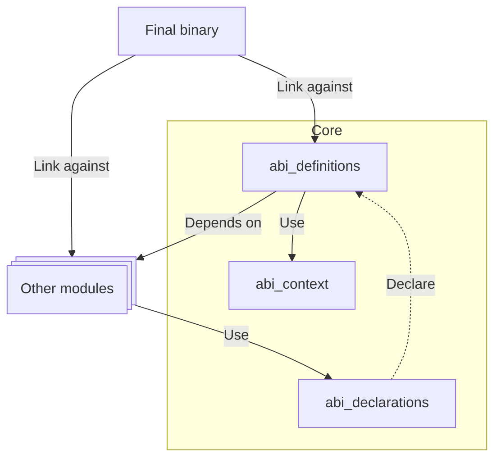

# 🔗 ABI

The ABI module defines Xila's stable C-callable surface for foreign runtimes and C-compatible consumers.

## Role in system

- Exposes a C ABI facade over core services (file, memory, task, time, user-related types).
- Provides symbol and type ownership needed for static/dynamic linkage across Rust and non-Rust components.
- Supplies per-task file-context indirection used by runtime integrations.

## Responsibilities and boundaries

**In scope**

- Exported C symbols and C-representable data layouts.
- Conversion between C-level identifiers/pointers and internal Rust APIs.
- ABI-local context for open file/directory handles.

**Out of scope**

- Runtime-specific host-call dispatch mechanics (handled by [Bindings](./bindings.md)).
- Full parity with every internal Rust API (ABI coverage is intentionally incremental).

## Internal architecture

The ABI is split into three crates with explicit roles:

- <HostReference crate="abi_declarations" />: declaration/header surface (`cbindgen`-driven output).
- <HostReference crate="abi_definitions" />: concrete `#[unsafe(no_mangle)] extern "C"` symbols and ABI structs.
- <HostReference crate="abi_context" />: process/task context (task-local file/directory tables and path resolution helpers).

This separation prevents duplicate-symbol/linkage ambiguity and keeps contract vs implementation boundaries explicit.

**Contract vs implementation**

- **Contract**: exported C signatures/types and numeric error/result conventions.
- **Implementation**: how ABI functions call into VFS/task/memory internals, including lock strategy and helper abstractions.

```mermaid
graph TD
    Binary[Final binary]
    Other_modules@{ shape: processes, label: "Other modules" }

    subgraph Core
        ABI_declarations[abi_declarations]
        ABI_definitions[abi_definitions]
        ABI_context[abi_context]
    end

    Binary -->|Link against| ABI_definitions
    Binary -->|Link against| Other_modules
    ABI_definitions -->|Use| ABI_context
    ABI_declarations -.->|Declare| ABI_definitions
    Other_modules -->|Use| ABI_declarations
    ABI_definitions -->|Depends on| Other_modules
```

## Lifecycle and execution model

1. Runtime enters ABI call path.
2. `abi_context::Context::call_abi(...)` captures current `TaskIdentifier`.
3. ABI symbol executes, uses context tables (`FileIdentifier`, `UniqueFileIdentifier`) and proxies to module APIs.
4. Context task binding is cleared after call.

## Data/control flow

- File ABI calls convert C inputs -> `FileIdentifier` -> synchronous VFS wrappers via ABI context maps.
- Memory ABI calls adapt raw C pointers/sizes to memory manager functions and metadata wrappers.
- Task/time ABI calls route to module managers with ABI-compatible result codes.

## Concurrency and synchronization model

- ABI context uses internal `RwLock` to guard file/directory maps and active task marker.
- Some ABI subsystems (notably memory allocation entry points) serialize specific operations with explicit mutexes.
- Most exported functions are synchronous at the C boundary, with async internals bridged via `task::block_on` where required.

## Dependency model

- Depends heavily on [Virtual file system](./virtual_file_system.md), [Task](./task.md), [Memory](./memory.md), [Time](./time.md), and [Log](./log.md).
- Consumed by runtimes such as [Virtual machine](./virtual_machine.md) integration paths.

## Failure semantics and recovery behavior

- ABI functions typically return numeric result codes (`0` success, non-zero mapped from module errors).
- Errors are logged at boundary points for diagnosability.
- Invalid pointers/identifiers are rejected early where conversion helpers exist.

## Extension points

- Add new exported functions/types in definitions and declarations, then regenerate headers.
- Extend ABI context identifier ranges or table behavior as new handle classes are introduced.
- Incrementally expose additional module capabilities through stable C signatures.

## Known limitations and trade-offs

- Coverage is partial by design; several exported subsystems include `todo!()` placeholders in current implementation.
- C boundary introduces conversion and safety-check overhead versus native Rust calls.
- ABI stability requires strict versioning discipline for signatures, constants, and generated headers.

## References / See also

- <HostReference crate="abi_context" />
- <HostReference crate="abi_declarations" />
- <HostReference crate="abi_definitions" />
- [Bindings](./bindings.md)
