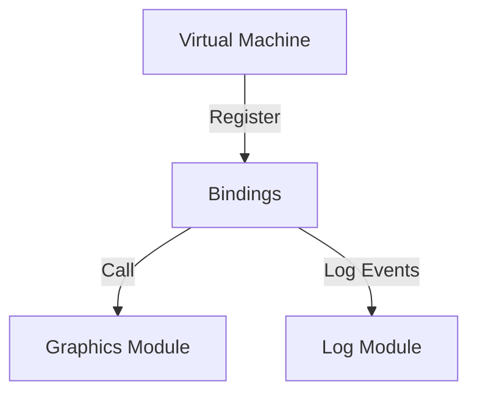
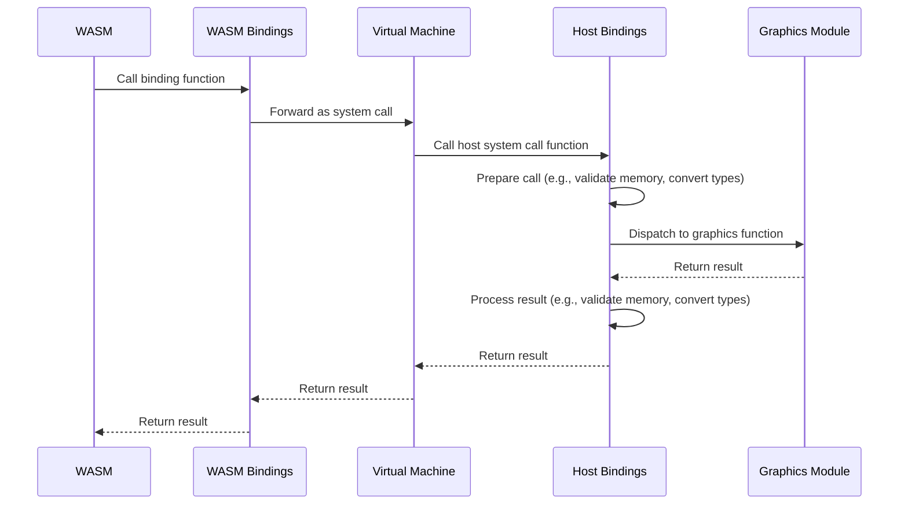

# 🔗 Bindings

The Bindings module in Xila provides an interface for interacting with external libraries and systems. While the [ABI](./abi.md) module focuses on standardized POSIX-compliant interfaces, the Bindings module is designed for more specialized or non-standard interactions, such as graphics.

## Dependencies

The Bindings module relies on the following components:

- [Graphics](./graphics.md): Facilitates rendering and graphical operations.
- [ABI](./abi.md): Provides low-level bindings to external C libraries.
- Internal crates:
  - [Synchronization](../crates/synchronization.md): Ensures thread-safe operations within the Bindings module.
  - [Shared](../crates/shared.md): Supplies common utilities and types used across Xila modules.

## Architecture

The Bindings module is divided into two distinct parts:

1. **Host Bindings**: Implemented on the host side (i.e., the system running the Xila OS). These bindings provide an interface to dispatch calls to various modules, primarily the Graphics module.
2. **WASM Bindings**: Implemented on the WASM side (i.e., the applications running within Xila). These bindings allow applications to invoke host bindings through system calls.

All WASM function calls are routed through a single function, <HostReference crate="host_bindings" kind="fn" symbol="call" />, which is executed by the virtual machine. The Bindings module is registered as a system call provider, enabling the virtual machine to dispatch calls to the appropriate host binding functions, such as graphics functions.

The Bindings module is automatically generated from the Graphics module using a build script that parses the Graphics module's public API. This ensures that the bindings remain synchronized with the Graphics module's API and minimizes the need for boilerplate code.

### Host-Side Architecture

### Calling Flow

The following sequence diagram illustrates the process when a binding function is invoked from the WASM side:

### Summary of the Calling Flow

1. The WASM code invokes a client binding function, which acts as a simple wrapper around a single function call (e.g., <HostReference crate="host_bindings" kind="fn" symbol="call" />).
2. The client binding function forwards the call as a system call to the virtual machine.
3. The virtual machine invokes the host system call function registered by the Bindings module.
4. The host binding function validates the call (e.g., checks memory addresses, converts data types) and dispatches it to the appropriate Graphics module function.
5. The Graphics module function executes the requested operation and returns the result to the host binding function.
6. The host binding function processes the result (e.g., validates memory, converts data types) and sends it back to the virtual machine.
7. The virtual machine returns the result to the WASM binding function.
8. The WASM binding function delivers the result to the WASM code.

## Known Limitations

The Bindings module currently has the following limitations:

- **Limited Coverage**: Only a subset of Xila's functionalities is exposed through the Bindings module.
- **Performance Overhead**: Invoking functions through bindings introduces additional overhead compared to direct native Rust calls.
- **Parameter Type Limitation**: All parameters are currently passed as <HostReference crate="virtual_machine" kind="type" symbol="WasmUsize" />, which is `u32` on the `wasm32` architecture. While `wasm64` is not currently relevant for Xila, this could pose a limitation for supporting future architectures. A potential improvement could involve binding <HostReference crate="virtual_machine" kind="type" symbol="WasmUsize" /> to `usize` in the future. This would allow 32-bit architectures to run only 32-bit WASM code, while 64-bit architectures could support both 32-bit and 64-bit WASM code.

## Future Improvements

Planned enhancements for the Bindings module include:

- **Expanded Coverage**: Gradually exposing more Xila functionalities to provide a comprehensive interface.
- **Performance Optimization**: Reducing overhead by minimizing data conversions and improving calling conventions.

## References

- <HostReference crate="host_bindings" />
- <HostReference crate="wasm_bindings" />
- <HostReference crate="bindings_utilities" />

## See Also

- [ABI](./abi.md)
