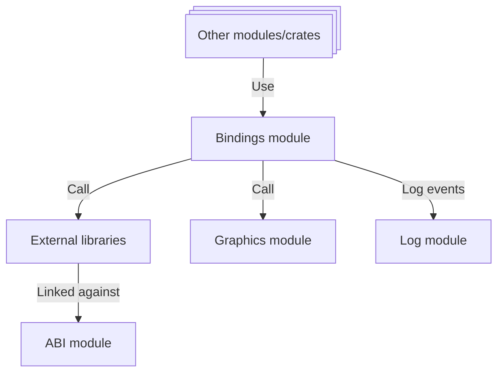

# 🔗 Bindings

Similar to the [ABI](./abi.md) module, the Bindings module in Xila provides an interface for interacting with external libraries and systems. However, while the ABI module focuses standardized/POSIX-compliant interfaces, the Bindings module is designed for more specialized or non-standard interactions (like graphics).

## Dependencies

The Bindings module depends on the following modules:

- [Graphics](./graphics.md): Used for rendering and graphical operations.
- [ABI](./abi.md): Used to provide low-level bindings to external C libraries.
  It also relies on the following internal crates:
- [Synchronization](../crates/synchronization.md): Provides thread-safe operations within the Bindings module.
- [Shared](../crates/shared.md): Provides common utilities and types used across Xila modules.

## Architecture

## Known Limitations

The Bindings module has the following known limitations:

- **Limited Coverage**: Only a subset of Xila's functionalities is currently exposed through bindings.
- **Performance Overhead**: Calling functions through bindings introduces overhead compared to native Rust calls.

## Future Improvements

Planned future improvements for the Bindings module include:

- **Expand Coverage**: Gradually expose more Xila functionalities to provide a comprehensive interface.
- **Optimize Performance**: Implement optimizations to minimize overhead, such as reducing data conversions and
  improving calling conventions.

## References

- <HostReference crate="bindings" />

## See Also

- [ABI](./abi.md)
