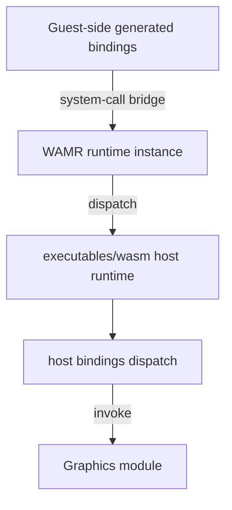
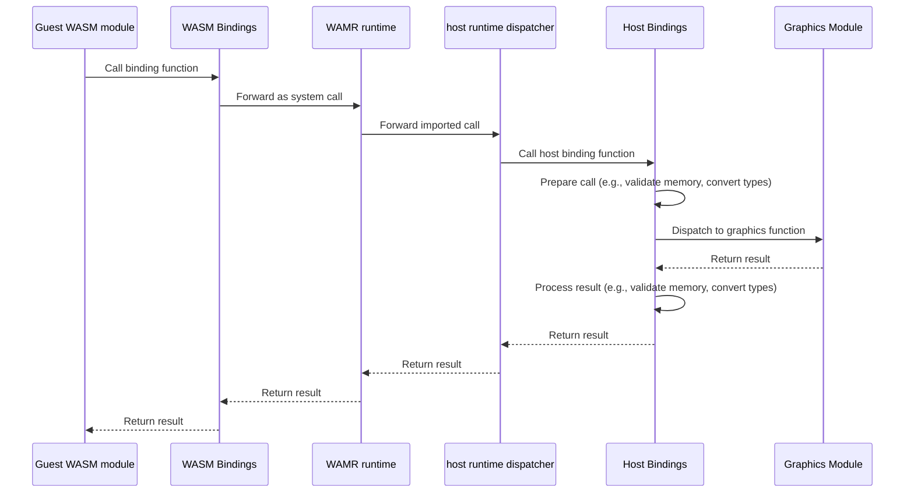

# 🔗 Bindings

Bindings provide runtime-specific host-call bridges for APIs that are not modeled as generic ABI exports.

In the current codebase this layer lives in the WASM executable host path and is primarily graphics-focused.

## Role in system

- Connects WASM guest calls to host-side Xila module functions.
- Handles guest/host pointer translation and ownership-domain translation.
- Provides a generated dispatch surface to avoid handwritten call-by-call glue.

## Responsibilities and boundaries

**In scope**

- Host-call entrypoints (`xila_graphics_call` and generated sub-dispatch).
- Argument/result translation (`WasmUsize` values, pointer mapping, object identity map).
- Locking around host module interactions that require global serialization (graphics/LVGL path).

**Out of scope**

- General C ABI compatibility contract (owned by [ABI](./abi.md)).
- WASM runtime instantiation lifecycle (owned by [Virtual machine](./virtual_machine.md)).

## Internal architecture

- `Core/executables/wasm/src/host/bindings/mod.rs` currently exports `graphics` bindings only.
- Graphics bindings are split into:
  - generated call tables (`include!(.../bindings.rs)`),
  - translation helpers (`translate.rs`),
  - additional handwritten adapters (`additionnal.rs`),
  - error mapping and dispatch wrapper (`call`/`call_inner`).
- `GraphicsBindings` implements VM `Registrable`, exposing function descriptors used at runtime registration.

**Contract vs implementation**

- **Contract**: function names/signatures visible to guest imports (for example `xila_graphics_call`).
- **Implementation**: translator internals, object map policy, and exact lock sequencing on host side.

### Host-Side Architecture

```mermaid
graph TD
    Guest[Guest-side generated bindings]
    HostRuntime[executables/wasm host runtime]
    HostBindings[host bindings dispatch]
    Graphics_module[Graphics module]
    VM[WAMR runtime instance]

    Guest -->|system-call bridge| VM
    VM -->|dispatch| HostRuntime
    HostRuntime --> HostBindings
    HostBindings -->|invoke| Graphics_module
```

## Lifecycle and execution model

1. VM runtime registers binding functions from `Registrable` providers.
2. Guest invokes imported binding function.
3. Host dispatch enters `call`, translates arguments, acquires required locks, and invokes module API.
4. Result/error is translated to ABI-compatible return representation.

## Data/control flow

The sequence below reflects the current call chain:

```mermaid
sequenceDiagram
    participant W as Guest WASM module
    participant B as WASM Bindings
    participant VM as WAMR runtime
    participant H as host runtime dispatcher
    participant G as Host Bindings
    participant GM as Graphics Module

    W->>B: Call binding function
    B->>VM: Forward as system call
    VM->>H: Forward imported call
    H->>G: Call host binding function
    G->>G: Prepare call (e.g., validate memory, convert types)
    G->>GM: Dispatch to graphics function
    GM-->>G: Return result
    G->>G: Process result (e.g., validate memory, convert types)
    G-->>H: Return result
    H-->>VM: Return result
    VM-->>B: Return result
    B-->>W: Return result
```

## Concurrency and synchronization model

- Binding execution is serialized where required by downstream module invariants (graphics path acquires manager lock before dispatch).
- Translator state is tied to VM execution environment custom data.
- Pointer translation distinguishes guest-owned memory from host-owned object references.

## Dependency model

- Depends on [Virtual machine](./virtual_machine.md) registration and execution callbacks.
- Depends on [Graphics](./graphics.md) for current exported functional surface.
- Complements [ABI](./abi.md) rather than replacing it.

## Failure semantics and recovery behavior

- Dispatch returns `0` on success and negative/enum-backed error values on failure.
- Translation failures (invalid pointer/object mapping) short-circuit call execution.
- Host logs include function id and raw arguments for failure diagnosis.

## Extension points

- Add new binding families under `host/bindings/<domain>` and register via `Registrable`.
- Extend codegen to include additional APIs while keeping guest/host call tables aligned.
- Expand translation adapters for new opaque object classes.

## Known limitations and trade-offs

- Current coverage is intentionally narrow (graphics-centric).
- `WasmUsize`-based argument passing constrains ABI shape to current wasm target width expectations.
- Manual safety boundary validation remains mandatory at each call edge.

## References / See also

- <HostReference crate="host_bindings" />
- <HostReference crate="wasm_bindings" />
- <HostReference crate="bindings_utilities" />
- [ABI](./abi.md)
