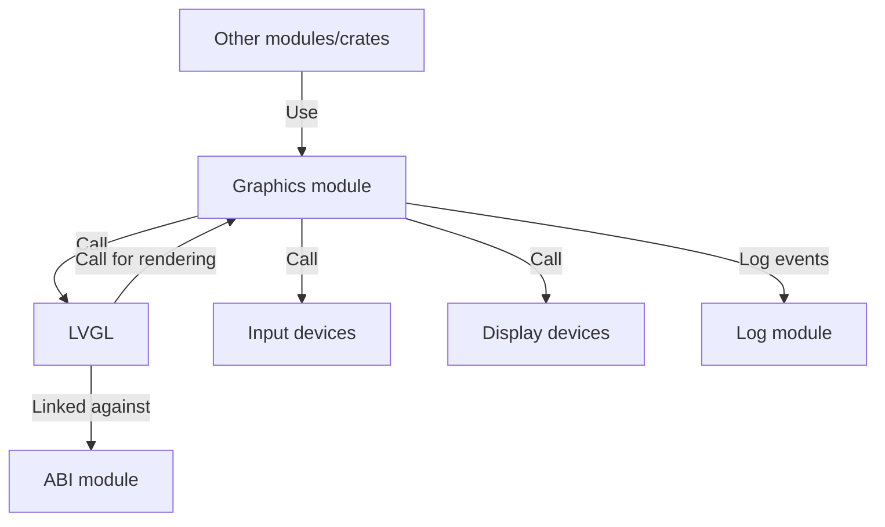

# Graphics

The `Graphics` module provides a set of modules to create and manage graphical user interfaces (GUIs) in Xila.

## Features

The Graphics module includes the following features:

- **Window Management**: Create, manage, and render windows and dialogs.
- **Widget Library**: A collection of standard GUI widgets such as buttons, labels, text boxes, and sliders.
- **Event Handling**: Mechanisms to handle user input events like mouse clicks and keyboard input.
- **Device abstraction**: Support for various display and input devices through a unified interface.
- **Rendering Engine**: Efficient rendering of graphical elements using hardware acceleration where available.
- **Theming Support**: Customizable themes for consistent look and feel across applications.

## Dependencies

The Graphics module depends on built on top of [LVGL](https://lvgl.io/), a popular open-source graphics library for embedded systems.

The graphics module depends on the following modules:

- [Memory](./memory.md): Used for dynamic memory allocation for graphical elements.
- [Task](./task.md): Used to manage rendering and event handling tasks.
- [ABI](./abi.md): Since LVGL is written in C, the ABI module is used to provide Rust bindings to the LVGL library (like allocation functions, etc.).

The graphics module also relies on the following internal crates:

- [Synchronization](../crates/synchronization.md): Provides thread-safe operations within the Graphics module.
- [Shared](../crates/shared.md): Provides common utilities and types used across Xila
- [Internationalization](../crates/internationalization.md): Provides support for multiple languages and character sets.

## Architecture

## Known limitations

The Graphics module has the following known limitations:

- **C style API**: Graphics module doesn't cover all of the LVGL functions and features. All of the graphical operations must be done through the LVGL C API which is unsafe an requires manual locking (and carefull pointer manipulation). A safe Rust wrapper around LVGL is planned for the future.

## Future improvements

Planned future improvements for the Graphics module include:

- **Safe Rust wrapper for LVGL**: Develop a safe and ergonomic Rust wrapper around the LVGL C API to simplify graphical operations and ensure memory safety. This should be auto-generated with build script or procedural macros to cover all of LVGL features.

## References

- <HostReference path="graphics/index.html" text="Graphics Module" />

## See also

- [File system](../crates/file_system.md)
