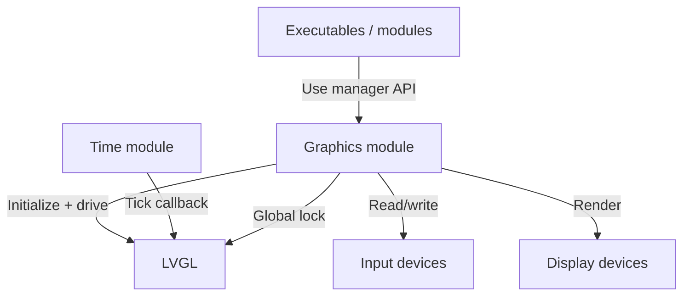

# 🖼️ Graphics

The Graphics module provides the UI/runtime layer used by graphical executables in Xila.

It wraps LVGL initialization, display/input device plumbing, window management, and event-loop integration behind a singleton manager.

## Features

The Graphics module includes the following features:

- **LVGL lifecycle management**: Initializes LVGL and sets tick callback integration with the Time module.
- **Display and input abstraction**: Connects character devices to LVGL display/input drivers.
- **Window services**: Create, enumerate, and focus windows via manager APIs.
- **Theme services**: Centralized theme initialization and runtime update.
- **Global lock API**: Explicit lock helpers for safe interaction with LVGL state.

## Dependencies

The Graphics module is built on top of [LVGL](https://lvgl.io/), a popular open-source graphics library for embedded systems.

The graphics module depends on the following modules:

- [Memory](./memory.md): Used for dynamic memory allocation for graphical elements.
- [Task](./task.md): Used to manage rendering and event handling tasks.
- [ABI](./abi.md): Since LVGL is written in C, the ABI module is used to provide Rust bindings to the LVGL library (like allocation functions, etc.).
- [Time](./time.md): Used as LVGL tick/time source.

The graphics module also relies on the following internal crates:

- [Synchronization](../crates/synchronization.md): Provides thread-safe operations within the Graphics module.
- [Shared](../crates/shared.md): Provides common utilities and types used across Xila
- [Internationalization](../crates/internationalization.md): Provides support for multiple languages and character sets.

## Architecture

```mermaid
graph TD
    A[Executables / modules] -->|Use manager API| B[Graphics module]
    B -->|Initialize + drive| LVGL
    B -->|Read/write| Input_devices[Input devices]
    B -->|Render| Display_devices[Display devices]
    Time_module[Time module] -->|Tick callback| LVGL
    B -->|Global lock| LVGL
```

## Known limitations

The Graphics module has the following known limitations:

- **C style API boundary**: Not all LVGL features are wrapped in safe high-level Rust APIs yet.
- **Manual lock discipline**: Complex operations may require explicit manager locking to avoid concurrent LVGL state access.
- **Display model constraints**: Current initialization path assumes one primary display at startup (with extensibility for additional input devices).

## Future improvements

Planned future improvements for the Graphics module include:

- **Safe Rust wrapper for LVGL**: Develop a safe and ergonomic Rust wrapper around the LVGL C API to simplify graphical operations and ensure memory safety. This should be auto-generated with build script or procedural macros to cover all of LVGL features.
- **Broader safe API coverage**: Extend native Rust abstractions for common widgets and composition patterns.

## References

- <HostReference crate="graphics" />

## See also

- [File system](../crates/file_system.md)
