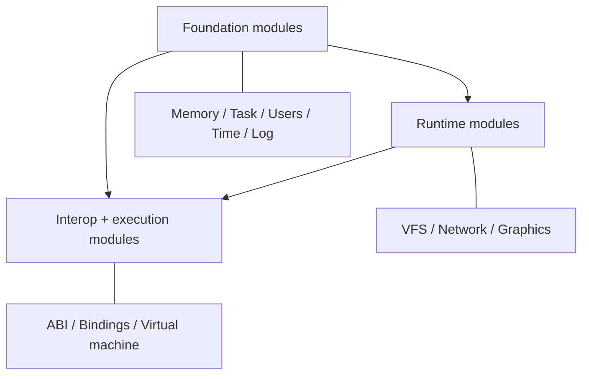

# 📦 Modules

Xila is organized as composable modules with explicit contracts and concrete implementations. Most core modules expose a singleton manager (`OnceLock` + lock-protected state), then publish a typed API consumed by other modules and executables.

This section is an architecture map, grouped by system role.

## Recommended reading order

1. [🗃️ Virtual file system](./virtual_file_system.md)
2. [🏁 Task](./task.md)
3. [🌐 Network](./network.md)
4. [🔗 ABI](./abi.md)
5. [🔗 Bindings](./bindings.md) (runtime integration path)
6. Remaining modules and integrations: [🧠 Memory](./memory.md), [👥 Users](./users.md), [🕓 Time](./time.md), [📝 Log](./log.md), [🖼️ Graphics](./graphics.md), [🖥️ Virtual machine](./virtual_machine.md)

## Foundation modules

- [🧠 Memory](./memory.md): Allocation contract (`ManagerTrait`), global allocator bridge, capability flags, and cache/page helpers.
- [🏁 Task](./task.md): Global task registry, executor/spawner integration, metadata inheritance, and signal delivery.
- [👥 Users](./users.md): In-memory user/group database and identifier/membership resolution.
- [🕓 Time](./time.md): Global time source abstraction over a direct character device.
- [📝 Log](./log.md): Global logging bridge (`LoggerTrait`) on top of `log` ecosystem integration.

## Runtime modules

- [🗃️ Virtual file system](./virtual_file_system.md): Path namespace, mount dispatch (file systems/devices/pipes), ownership/permission checks.
- [🌐 Network](./network.md): `smoltcp` interface stacks, runner tasks, control-device surface under `/devices/network/*`.
- [🖼️ Graphics](./graphics.md): LVGL runtime management, display/input plumbing, window/event services.

## Interop and runtime-integration pages

- [🔗 ABI](./abi.md): C ABI surface split across declarations, symbol definitions, and per-task ABI context.
- [🔗 Bindings](./bindings.md): Module-adjacent runtime integration implemented in executable/WASM host paths for host-call dispatch and guest/host pointer translation.
- [🖥️ Virtual machine](./virtual_machine.md): Module-adjacent runtime integration implemented in executable/WASM host paths for WAMR execution, instantiation, and host callback wiring.

## Cross-module wiring (high level)

