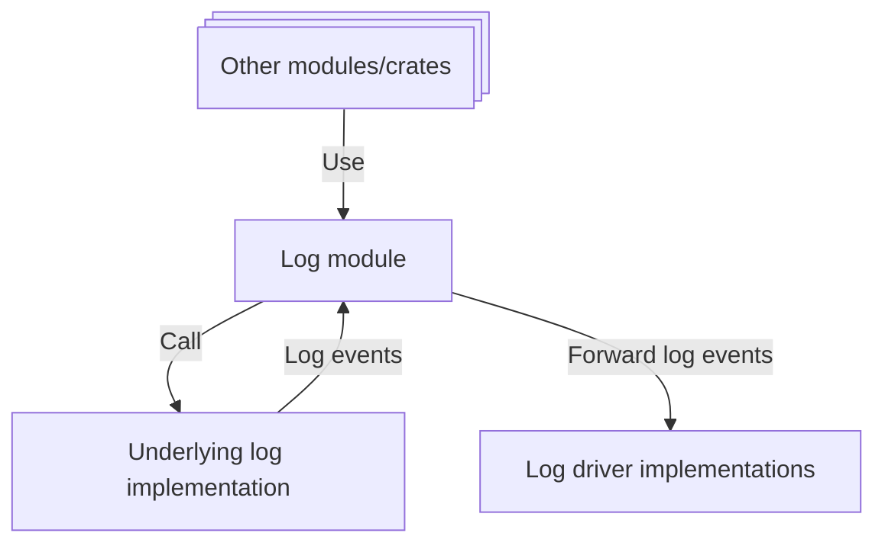

# 📝 Log

The Log module provides logging capabilities for the Xila operating system. It enables other modules to record events, errors, and informational messages, facilitating debugging and system monitoring.

## Features

The Log module offers the following features:

- **Log Levels**: Support for multiple severity levels (e.g., DEBUG, INFO, WARN, ERROR) to categorize messages.
- **Backend Abstraction**: A unified interface that supports various underlying implementations (e.g., console output, file logging, remote logging).
- **Thread Security**: Ensures that concurrent log messages from multiple tasks are handled safely without data corruption.
- **Configurable Output**: Options to customize log output formats and destinations.

## Dependencies

The Log module depends on the following crates:

- [Synchronization](../crates/synchronization.md): Used to ensure thread-safe logging operations.

## Architecture

The Log module primarily serves as a wrapper around the `log` crate, exposing a unified logging interface for the OS.
Unlike other hardware components, log backends are not implemented as standard drivers. Instead, they utilize a specific trait that can be implemented by various logging destinations.

## Known limitations

There are currently no known limitations.

## Future improvements

There are no improvements planned at the moment.

## References

- <HostReference crate="log" />

## See also

- [Drivers](../drivers.md)
- [Synchronization](../crates/synchronization.md)
