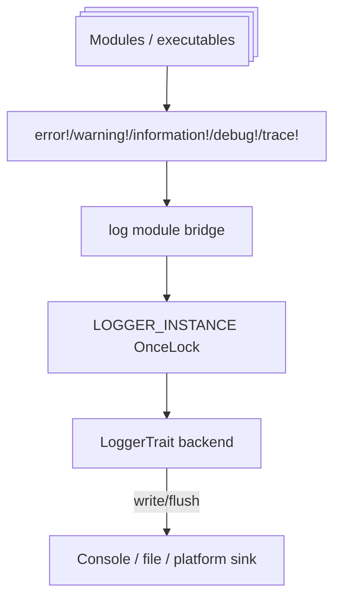

# 📝 Log

The Log module is the global bridge between Xila logging calls and a concrete backend implementation.

## Role in system

- Provides uniform log macros (`error!`, `warning!`, `information!`, `debug!`, `trace!`) across modules.
- Adapts Xila-specific `LoggerTrait` to the external `log` crate runtime.
- Centralizes level filtering and formatted record emission policy.

## Responsibilities and boundaries

**In scope**

- Global logger initialization and registration.
- Severity-level mapping and default formatting.
- Backend trait abstraction (`enabled`, `write`, optional `flush`).

**Out of scope**

- Transport/storage mechanics (console, serial, file, remote).
- Advanced aggregation/query infrastructure.

## Internal architecture

- `LOGGER_INSTANCE: OnceLock<Logger>` stores single logger adapter.
- `LoggerTrait` is backend contract; `Logger` adapter implements `log_external::Log`.
- `Record` structure captures normalized level/target/arguments.
- Default `LoggerTrait::log` formatting decorates lines with level tag and ANSI color tokens.

**Contract vs implementation**

- **Contract**: backend `LoggerTrait` methods and macro-level behavior.
- **Implementation**: concrete formatting/color tokens and `set_max_level` policy.

```mermaid
graph TD
    Clients@{ shape: processes, label: "Modules / executables" }
    Macros[error!/warning!/information!/debug!/trace!]
    Bridge[log module bridge]
    Once[LOGGER_INSTANCE OnceLock]
    Backend[LoggerTrait backend]

    Clients --> Macros
    Macros --> Bridge
    Bridge --> Once
    Once --> Backend
    Backend -->|write/flush| Output[Console / file / platform sink]
```

## Lifecycle and execution model

1. Platform creates backend implementing `LoggerTrait`.
2. Runtime calls `log::initialize(...)` once.
3. Module macros emit through `log` ecosystem into adapter and backend sink.

## Data/control flow

- Macro invocation -> `log_external` -> `Logger` adapter -> `LoggerTrait::enabled/log/write`.
- Initialization attempts after first registration do not replace logger; they emit an error log.

## Concurrency and synchronization model

- Singleton registration guarded by `OnceLock`.
- Thread-safety at runtime relies on backend `LoggerTrait: Send + Sync` and backend internals.

## Dependency model

- Depends on `log` ecosystem crate for macro/runtime integration.
- Consumed by nearly all core modules for diagnostics.

## Failure semantics and recovery behavior

- `initialize` returns `Ok(())` even if logger was already set in `log` runtime; duplicate init is reported via error record.
- Backend write/flush behavior is backend-defined; module itself does not buffer/retry.

## Extension points

- Provide alternative backend implementations for each platform.
- Override `LoggerTrait::log` for custom formatting or structured payload conventions.
- Add runtime filtering policy in backend or wrapper layer.

## Known limitations and trade-offs

- Single global logger; dynamic replacement/reconfiguration is limited.
- Formatting includes ANSI control sequences by default, which may be undesirable in non-terminal sinks unless backend adapts.
- Reliability guarantees (buffering, durability) are sink-specific.

## References / See also

- <HostReference crate="log" />
- [Drivers](../drivers.md)
- [Synchronization](../crates/synchronization.md)
