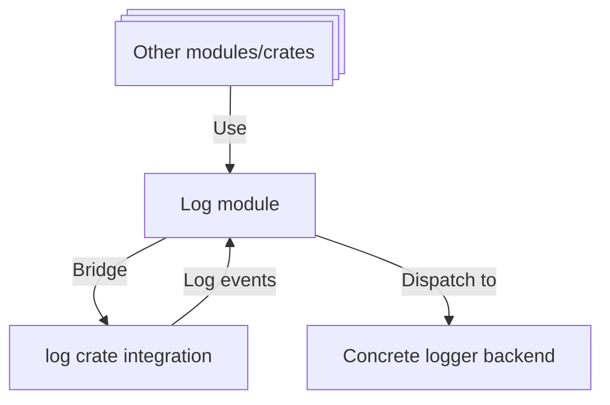

# 📝 Log

The Log module centralizes runtime logging across Xila.

It bridges Xila logging calls to a pluggable backend through a `LoggerTrait` implementation and integrates with the underlying `log` ecosystem.

## Features

The Log module offers the following features:

- **Log Levels**: Support for multiple severity levels (e.g., DEBUG, INFO, WARN, ERROR) to categorize messages.
- **Backend abstraction**: Backends implement `LoggerTrait` (`enabled`, `write`, `flush`).
- **Single initialization point**: Logger registration is guarded by a global `OnceLock`.
- **Formatted output helper**: Default log formatting includes level marker and target.
- **`no_std` friendly API surface**: Suitable for embedded and constrained targets.

## Dependencies

The Log module depends on the following crates:

- [🔃 Synchronization](../crates/synchronization.md): Used for one-time global logger initialization.

## Architecture

At startup, a concrete backend is registered once through `initialize`. After registration, all module-level log macros route through that backend.

Unlike many other subsystems, logging is not modeled as a file system device by default. Instead, platform crates provide logger implementations directly.

```mermaid
graph TD
    A@{ shape: processes, label: "Other modules/crates" }
    Log_crate[log crate integration]
    Log_module[Log module]
    Driver

    A -->|Use| Log_module
    Log_module -->|Bridge| Log_crate
    Log_crate -->|Log events| Log_module

    Log_module -->|Dispatch to| Driver[Concrete logger backend]
```

## Initialization flow

1. Implement `LoggerTrait` in a platform logger backend.
2. Register it once through `log::initialize(&your_logger)`.
3. Use logging macros from modules/executables (`error!`, `warning!`, `information!`, `debug!`, `trace!`).

## API snapshot

- `log::initialize(...)`: Initializes global logger bridge.
- `log::is_initialized()`: Indicates whether logger has been initialized.
- `LoggerTrait::enabled(...)`: Per-level filtering hook.
- `LoggerTrait::write(...)` and `LoggerTrait::flush(...)`: Output and flush hooks.

## Known limitations

- The logger is effectively global and should be initialized early.
- Per-target formatting and transport behavior depends on the backend implementation.
- Runtime reconfiguration is limited once initialization happened.

## Future improvements

- Runtime filtering/policy controls per module or target.
- Additional structured logging options for machine parsing.

## References

- <HostReference crate="log" />

## See also

- [Drivers](../drivers.md)
- [Synchronization](../crates/synchronization.md)
