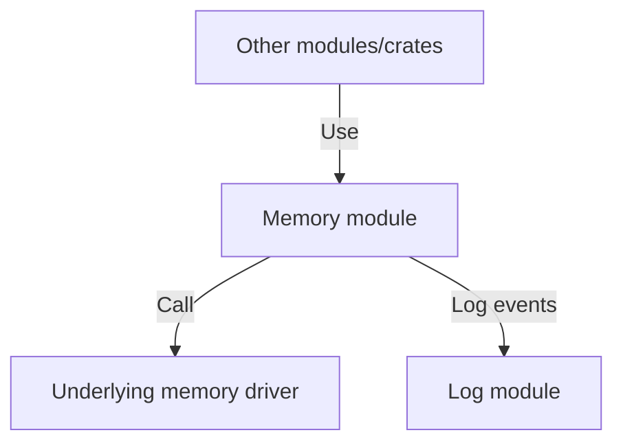

# 🧠 Memory

The Memory module is responsible for managing the system's memory resources within the Xila operating system. It provides functionalities for memory allocation, deallocation, and tracking of memory usage across different modules and applications.

## Features

The Memory module offers the following features:

- **Dynamic memory allocation**: Provides functions to allocate and deallocate memory at runtime on memory with capabilities (data, executable, etc.). It either supports layout or layout-less allocations (C-style).
- **Manage cache**: Allow to flush and control caches.
- **Memory tracking**: Monitors memory usage to prevent leaks and optimize performance.
- **`alloc`** integration: Implements the Rust `alloc` crate functionalities for heap memory management.

## Dependencies

The memory module depends on the following crates:

- [Synchronization](../crates/synchronization.md): Used for thread-safe operations within the Memory module.
- [Shared](../crates/shared.md): Provides common utilities and types used across Xila modules.

The Memory module also relies on the following modules:

- [Log](./log.md): Used for logging memory-related events and errors.

## Architecture

The Memory module is structured around a `MemoryManager` struct that encapsulates the core functionalities of memory management. It provides methods for allocating and deallocating memory blocks, as well as tracking memory usage.

## Known limitations

The Memory module has the following known limitations:

- **Fragmentation**: Over time, memory fragmentation may occur, leading to inefficient memory usage. Future improvements could include defragmentation strategies.

## Future improvements

Planned future improvements for the Memory module include:

- **Advanced allocation strategies**: Implement more sophisticated memory allocation algorithms/methods like slab allocation or buddy system to optimize memory usage and reduce fragmentation.

## References

- <HostReference crate="memory" />

## See also

- [Drivers](../drivers)
