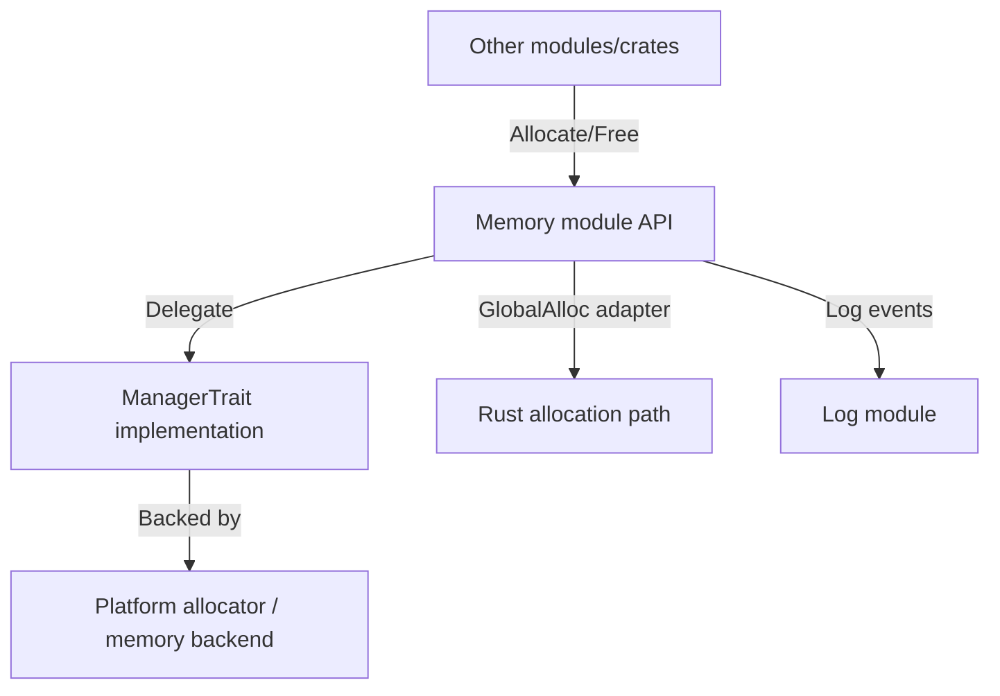

# 🧠 Memory

The Memory module provides Xila's allocation and memory-management abstraction.

It exposes a manager interface for allocation/deallocation/reallocation, supports capability-aware requests, and acts as the bridge between Xila internals and Rust's global allocation flow.

## Features

The Memory module offers the following features:

- **Dynamic allocation primitives**: Allocate, deallocate, and reallocate blocks with Rust layout semantics.
- **Capability flags**: Request memory with specific properties (for example executable or DMA-related capabilities).
- **Cache control hooks**: Flush data/instruction cache when required by a platform.
- **Statistics surface**: Exposes used/free/total memory metrics through manager APIs.
- **Global allocator integration**: Adapter layer implementing `GlobalAlloc` for Rust runtime allocations.

## Dependencies

The memory module depends on the following crates:

- [🔃 Synchronization](../crates/synchronization.md): Used by concrete manager implementations.
- [📦 Shared](../crates/shared.md): Provides common flags/utilities used by memory abstractions.

The Memory module also relies on the following modules:

- [Log](./log.md): Used for logging memory-related events and errors.

## Architecture

The module defines a `ManagerTrait` contract and exposes a wrapper used by both explicit memory calls and Rust's global allocator path.

```mermaid
graph TD
    A[Other modules/crates] -->|Allocate/Free| B[Memory module API]
    B -->|Delegate| C[ManagerTrait implementation]
    C -->|Backed by| D[Platform allocator / memory backend]
    B -->|GlobalAlloc adapter| E[Rust allocation path]
    B -->|Log events| F[Log module]
```

## Known limitations

The Memory module has the following known limitations:

- **Fragmentation risk**: Long-lived mixed-size allocation patterns can reduce effective free space.
- **Backend-specific behavior**: Cache flushing and capability semantics depend on the concrete allocator implementation.

## Future improvements

Planned future improvements for the Memory module include:

- **Advanced allocation strategies**: Slab/buddy-style strategies for better fragmentation control.
- **Richer telemetry**: More detailed allocation diagnostics for debugging target-specific memory pressure.

## References

- <HostReference crate="memory" />

## See also

- [Drivers](../drivers.md)
- [🔃 Synchronization](../crates/synchronization.md)
