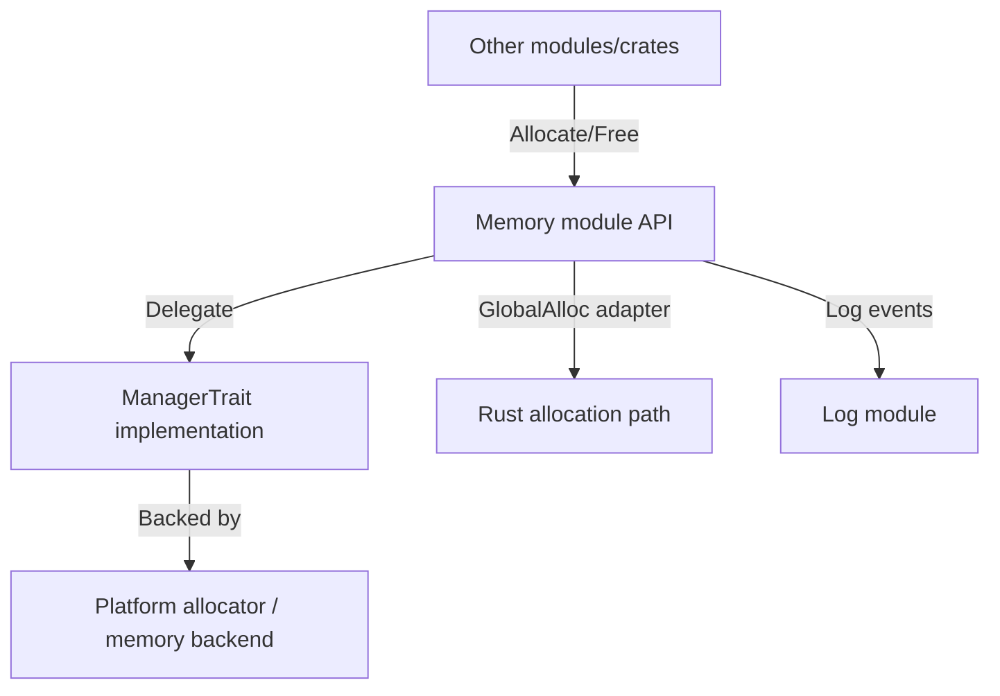

# 🧠 Memory

The Memory module defines allocation contracts and the runtime bridge to the active allocator implementation.

## Role in system

- Provides the system allocation API (`allocate`, `deallocate`, `reallocate`) with explicit `Layout` semantics.
- Exposes capability-aware allocation requests (`Executable`, `DirectMemoryAccess`).
- Serves as the source for Rust global allocator integration through `GlobalAlloc` wrapper.

## Responsibilities and boundaries

**In scope**

- `ManagerTrait` contract for allocation/backing allocator implementations.
- `Manager` wrapper adapting trait object to safe/unsafe call sites and `GlobalAlloc`.
- Cache and page-size helper surface.

**Out of scope**

- Choosing one universal allocator strategy for all targets.
- Owning platform-specific heap region setup (performed by platform crates/linking symbols).

## Internal architecture

- Core abstraction: `ManagerTrait` (unsafe allocation primitives + usage stats + cache hooks).
- Runtime wrapper: `memory::Manager<'a>(&'a dyn ManagerTrait)`.
- Global accessor: `memory::get_instance()` returns `__XILA_MEMORY_MANAGER` symbol provided by final runtime.
- Capability flags are bitflags (`Executable`, `DirectMemoryAccess`) used as hints/requirements for backend allocators.

**Contract vs implementation**

- **Contract**: `ManagerTrait` methods and expected safety invariants.
- **Implementation**: backend-specific allocation algorithms, region policies, and capability interpretation.

```mermaid
graph TD
    A[Other modules/crates] -->|Allocate/Free| B[Memory module API]
    B -->|Delegate| C[ManagerTrait implementation]
    C -->|Backed by| D[Platform allocator / memory backend]
    B -->|GlobalAlloc adapter| E[Rust allocation path]
    B -->|Log events| F[Log module]
```

## Lifecycle and execution model

1. Platform/runtime defines concrete manager and exports `__XILA_MEMORY_MANAGER`.
2. Consumers call memory APIs directly or through Rust allocation path.
3. Optional cache/page helpers are invoked for architecture-specific coherency needs.
4. ABI entrypoints may wrap operations with additional metadata and synchronization.

## Data/control flow

- Direct path: caller -> `Manager` -> trait object allocator backend.
- Rust alloc path: allocator trait implementation -> same `Manager` wrapper -> backend.
- ABI path: C ABI wrappers -> memory manager + allocation metadata helpers.

## Concurrency and synchronization model

- Thread-safety guarantee is part of `ManagerTrait: Send + Sync` contract.
- Synchronization strategy is backend-defined.
- ABI allocation wrappers currently serialize operations with a global mutex in their implementation layer.

## Dependency model

- Core depends on trait-based allocator implementation supplied externally.
- Used by virtually all modules via Rust allocation flow; additionally consumed explicitly in VM/ABI flows.

## Failure semantics and recovery behavior

- Allocation/reallocation returns null on failure at C-facing boundary and `None` at trait level.
- Deallocating null pointers is treated as no-op in wrapper behavior.
- Reallocate default implementation allocates-copy-deallocates, so failure can occur before ownership transfer.

## Extension points

- Provide new `ManagerTrait` implementations (region allocators, platform allocators, debug allocators).
- Extend capability semantics with additional flags when required by targets.
- Override cache/page methods for architecture-specific behavior.

## Known limitations and trade-offs

- Fragmentation and allocation behavior are backend-specific.
- Cache and capability guarantees are only as strong as backend implementation support.
- Cross-platform consistency requires disciplined backend conformance to trait contracts.

## References / See also

- <HostReference crate="memory" />
- [Drivers](../drivers.md)
- [🔃 Synchronization](../crates/synchronization.md)
