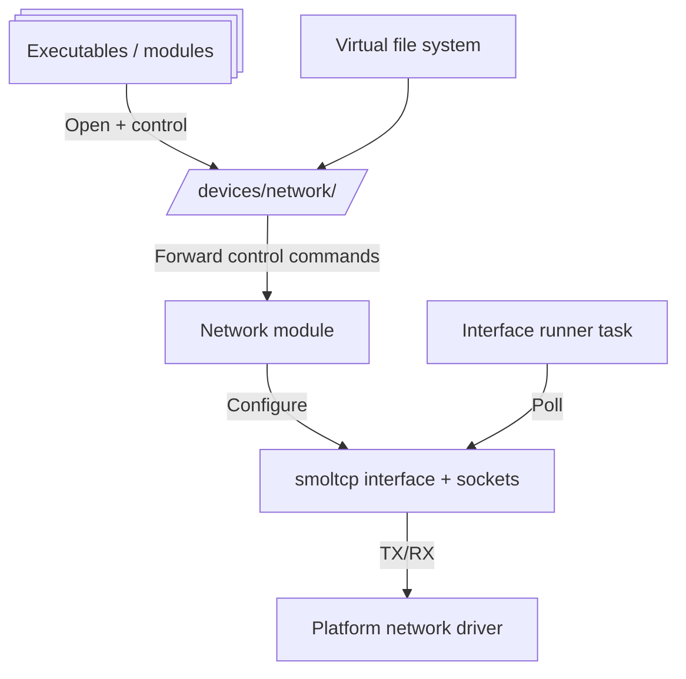

# 🌐 Network

The Network module provides Xila's asynchronous network runtime around `smoltcp`. It owns interface stacks, socket factories, and a control plane exposed as character devices under the VFS namespace.

## Role in system

- Manages network interface lifecycle and runtime polling.
- Exposes interface control and introspection via `/devices/network/<name>`.
- Provides typed async sockets (DNS, TCP, UDP, ICMP) backed by interface-local socket sets.

## Responsibilities and boundaries

**In scope**

- Interface registration (`mount_interface`) and per-interface stack creation.
- Stack runner task per interface.
- Socket creation and attachment to selected/available interface.
- Command-based control API (addresses, routes, DNS, DHCP, link state).

**Out of scope**

- L2/L3 driver implementation details (delegated to platform device backends).
- Persistent network configuration policy.
- High-level service abstractions (HTTP, TLS, etc.).

## Internal architecture

- Singleton `Manager` with `RwLock<Vec<Stack>>`.
- `StackInner` bundles:
  - interface name and state flags,
  - `smoltcp::iface::Interface` + `SocketSet`,
  - controller `DirectCharacterDevice`,
  - DNS/DHCP settings, MTU metadata, local ephemeral port allocator.
- `Stack` wrapper uses `Arc<Mutex<...>>` and a `WakeSignal` to coordinate socket calls with the runner loop.
- `NetworkDevice` implements VFS character-device control dispatch and forwards unknown control commands to platform controller device.

## Lifecycle and execution model

1. Initialize manager with random device source.
2. Mount interface: build stack, spawn `StackRunner`, expose control device in VFS.
3. Runner loop polls stack when enabled and sleeps/selects on timeout or wake signal.
4. Sockets are created against explicit interface or first available interface.
5. Closing sockets removes handles from stack-local `SocketSet`.

## Data/control flow

- Control path: `File::control(...)` on `/devices/network/<name>` -> `NetworkDevice::control` -> `StackInner` mutators.
- Data path: socket method -> stack/socket set access -> runner drives `smoltcp::Interface::poll(...)` with platform device IO.
- Wake path: socket/stack mutations signal runner for low-latency poll.

## Concurrency and synchronization model

- Manager-level stack list is `RwLock`-guarded.
- Per-stack mutable state is behind async mutex.
- Non-blocking lock attempts in control path may return `file_system::Error::RessourceBusy`.
- Progress is cooperative and tied to task scheduling quality.

## Dependency model

- Depends on [Task](./task.md) for spawning interface runners.
- Depends on [Virtual file system](./virtual_file_system.md) for control-device mounting.
- Depends on [Time](./time.md) for `smoltcp` time source conversion.
- Uses `smoltcp` as packet/socket engine and platform devices for concrete transport.

## Failure semantics and recovery behavior

- Duplicate interface names fail with `DuplicateIdentifier`.
- Interface/device mount failures are wrapped as `FailedToMountDevice(...)`.
- Socket creation fails with `NotFound` when no suitable interface is available.
- Protocol-specific errors map from `smoltcp` to module `Error` (for example bind/connect/state/timeouts).

## Extension points

- Add new interface kinds by providing `smoltcp::phy::Device` implementations and controller devices.
- Extend control command set via `define_command!` in device command module.
- Add new socket wrappers on top of stack/socket-set abstraction.

## Known limitations and trade-offs

- Command-oriented control surface is flexible but less discoverable than strongly typed high-level config APIs.
- Scheduling and latency depend on cooperative runner execution.
- Capability set varies by backend/controller implementation.

## Contract vs implementation

- **Stable module contract:** Interface lifecycle management, control-device exposure under `/devices/network/<name>`, and typed socket services with defined error mapping.
- **Current implementation details:** Singleton `Manager` with `RwLock<Vec<Stack>>`, `StackInner` composition, runner wake/poll coordination, and present command forwarding behavior to controller devices.
- **Compatibility note:** Integrations should target control commands, socket APIs, and documented failure semantics, not concrete stack container types, lock granularity, or runner-loop internals.

## References / See also

- <HostReference crate="network" />
- <CodeReference path="modules/network" />
- [🧰 Std driver crate](../drivers/std.md)
- [🌍 WASM driver crate](../drivers/wasm.md)
