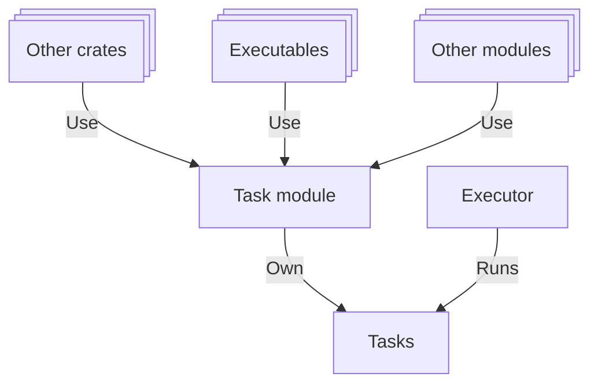

# 🏁 Task

Xila is a multitasking operating system designed to run multiple tasks simultaneously. Each task operates as a separate thread, running independently. Tasks can communicate with one another using messages and events.

## Features

The task module offers the following features:

- **Asynchronous tasks**: Support for async/await syntax for non-blocking operations. No need to manually yield control or context switch penalties.
- **Creation and deletion**: Create and delete tasks dynamically.
- **Scheduling**: Preemptive and cooperative multitasking.
- **Synchronization**: Semaphores, mutexes, and other synchronization primitives.
- **Communication**: Message queues and event flags for inter-task communication.

## Dependencies

The task module is built upon [embassy](https://github.com/embassy-rs/embassy) and utilizes the following crates:

- `embassy-executor`: Provides the executor for running asynchronous tasks.
- `embassy-sync`: Provides synchronization primitives like mutexes and semaphores.
- `embassy-time`: Provides time-related functionalities like delays and timeouts.

It also relies on the following modules:

- [Time](./time.md): Used for task delays and timeouts.
- [Users](./users.md): Used for task ownership and permissions.
- [Memory](./memory.md): Used for task stack allocation.

## Architecture

Each task is represented by a `Task` struct that contains the following information:

- Name.
- Parent task identifier.
- Environment variables: Automatically inherited from the parent task (deduplicated using Copy-on-Write).
- User: The user that owns the task.
- Group: The group that owns the task.
- Signals: The signals associated with the task (e.g., termination, kill).
- Spawner identifier: A reference to the executor that spawned the task.

Each of these structures can be accessed and modified through module APIs using the `TaskIdentifier`, which is a system-wide unique identifier for each task (unsigned half-register size integer).

Tasks are created on an executor, which must be registered beforehand. Typically, there is one executor per core or thread. These executors are platform-specific (as sleeping and waking the core/thread is platform-dependent) and must be initialized by the final executable.

## Known limitations

The task module has the following known limitations:

- **Cooperative Multitasking Requirement**: Because the system relies on a cooperative executor, all tasks must yield control periodically. Long-running tasks that do not await or yield will block the executor, preventing other tasks from running.

## Future improvements

Planned future improvements for the task module include:

- **Executor Migration**: Currently, tasks are bound to the executor they were created on. Future updates aims to allow tasks to be dynamically moved between executors to improve load balancing and resource utilization.

## References

- <HostReference crate="task" />

## See also

- [Time](./time.md)
- [Users](./users.md)
- [Memory](./memory.md)
