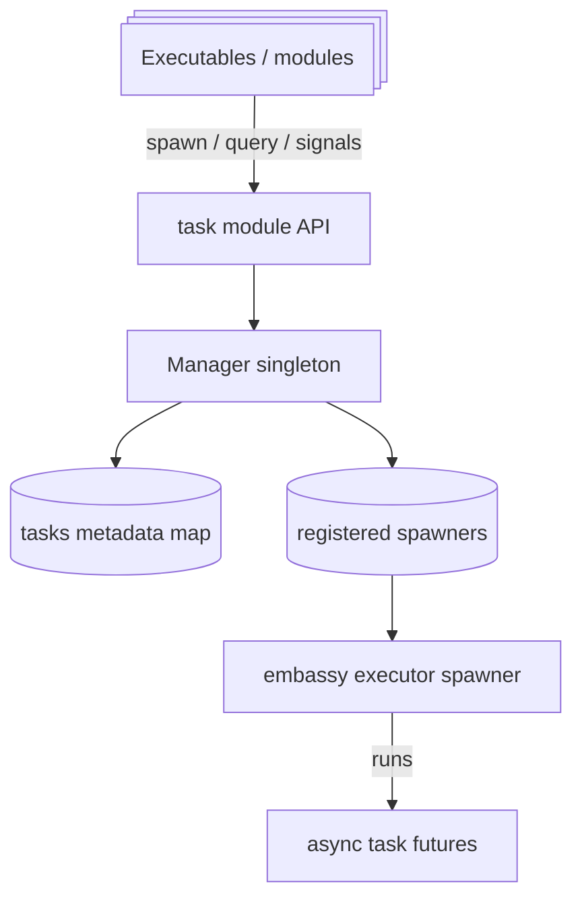

# 🏁 Task

The Task module owns runtime task identity and metadata, and delegates execution to registered `embassy_executor` spawners.

## Role in system

- Provides globally unique `TaskIdentifier` values and task metadata lookup.
- Connects task creation requests to executor-specific `Spawner` instances.
- Supplies cross-module identity context (for VFS, ABI context, users, signal handling).

## Responsibilities and boundaries

**In scope**

- Register/unregister tasks and maintain parent-child relationships.
- Track per-task metadata: name, user/group, environment variables, signals, spawner affinity.
- Spawn async futures on registered spawners and return `JoinHandle`.

**Out of scope**

- Preemptive scheduling policy (handled by underlying async executors).
- Authentication and credential persistence (handled outside this module).
- Kernel-like process address-space isolation (not modeled here).

## Internal architecture

- Singleton manager: `task::initialize()` + `task::get_instance()`.
- Core state is `RwLock`-guarded `Inner`:
  - `tasks: BTreeMap<TaskIdentifier, Metadata>`,
  - `identifiers: BTreeMap<usize, TaskIdentifier>` mapping executor-internal identity to task id,
  - `spawners: BTreeMap<usize, embassy_executor::Spawner>`.
- `Metadata` stores:
  - truncated task name (current code truncates to 23 chars during registration),
  - parent task id,
  - user/group,
  - cloned environment variable vector,
  - signal accumulator bitset,
  - spawner identifier + internal identifier.

```mermaid
graph TD
    Executables@{ shape: processes, label: "Executables / modules" }
    TaskAPI[task module API]
    Manager[Manager singleton]
    TasksMap[(tasks metadata map)]
    SpawnersMap[(registered spawners)]
    Spawner[embassy executor spawner]
    AsyncTask[async task futures]

    Executables -->|spawn / query / signals| TaskAPI
    TaskAPI --> Manager
    Manager --> TasksMap
    Manager --> SpawnersMap
    SpawnersMap --> Spawner
    Spawner -->|runs| AsyncTask
```

## Lifecycle and execution model

1. Initialize manager once.
2. Register one or more spawners from platform executors.
3. Spawn task: register metadata, pick explicit or best-load spawner, spawn future, bind internal identifier.
4. Task completion: signal join handle and unregister metadata.
5. Unregistering a task reparents its children to root task.

## Data/control flow

- `spawn(...)` -> `register(...)` -> spawner selection (`select_best_spawner`) -> `embassy` spawn token dispatch.
- Running task resolves its internal executor identity and updates `identifiers` map for reverse lookup.
- Cross-module callers query `get_current_task_identifier()` to recover logical task context.

## Concurrency and synchronization model

- Manager state is protected by a global async `RwLock`.
- Read-heavy queries (`get_user`, `get_group`, `peek_signal`, relationship queries) use read lock.
- Mutations (`register`, `unregister`, env updates, signal send/pop) use write lock.
- Scheduling is cooperative: forward progress requires tasks to await/yield.

## Dependency model

- `embassy_executor` / `embassy_futures` / `embassy_time` for execution and timing primitives.
- `users` typed identifiers are embedded in metadata.
- Consumers: VFS, ABI context, network runner spawning, and application runtimes.

## Failure semantics and recovery behavior

- Spawn fails with `NoSpawnerAvailable` / `InvalidSpawnerIdentifier` when spawner topology is invalid.
- Task table exhaustion yields `TooManyTasks`.
- Invalid identifiers return `InvalidTaskIdentifier` for metadata operations.
- On normal task completion, metadata cleanup is automatic via task wrapper closure.

## Extension points

- Additional spawner registration enables multi-executor deployment.
- Higher-level runtime code can build policy around parent selection, naming, and user/group assignments.
- Signal model supports POSIX-like enumerated events via `SignalAccumulator`.

## Known limitations and trade-offs

- Cooperative runtime: non-yielding futures can starve other tasks on the same executor.
- Spawner load balancing is task-count based and does not account for CPU or IO cost.
- ABI thread API coverage is partial (multiple `xila_thread_*` symbols are still `todo!()`).
- Name truncation in current registration path is fixed-width.

## Contract vs implementation

- **Stable module contract:** Global task identity, metadata access, signal operations, and async spawn/join behavior through module APIs independent of concrete executor internals.
- **Current implementation details:** Singleton manager lifecycle, `BTreeMap`-backed metadata/spawner tables, current spawner selection heuristic, and fixed-width task-name truncation policy.
- **Compatibility note:** Callers should rely on identifier, metadata, and spawn semantics rather than internal map layout or selection mechanics, which are implementation choices and may change.

## References / See also

- <HostReference crate="task" />
- [Time](./time.md)
- [Users](./users.md)
