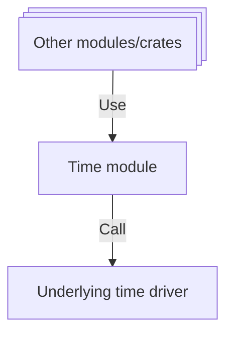

# 🕓 Time

The Time module provides functionalities for managing time and date within the Xila operating system. It offers APIs to retrieve, manipulate, and format system time.

## Features

The Time module includes the following features:

- **System and Uptime Management**: Functions to retrieve and set the current date and time (since epoch) and system uptime.
- **Hardware Abstraction**: Provides a consistent interface irrespective of the underlying hardware timers and clocks.
- **Time Zones**: Basic support for handling different time zones.
- **Time Formatting**: Utilities to format time and date into human-readable strings.

# Dependencies

The Time module relies on a platform-specific time driver to interact with hardware and ensure accurate timekeeping.

## Architecture

The Time module utilizes a standard character device to access a monotonic clock source. Upon this foundation, it builds high-level abstractions to manage the system wall clock and date.

## Known limitations

There are currently no known limitations.

## Future improvements

Planned enhancements for the Time module include:

- **Enhanced Time Zone Support**: Implementation of comprehensive time zone handling, including automatic daylight saving time adjustments.
- **Network Time Protocol (NTP)**: Integration of NTP client support to synchronize system time with external time servers for high precision.

## References

- <HostReference crate="time" />

## See also

- [Drivers](../drivers.md)
- [Synchronization](../crates/synchronization.md)
