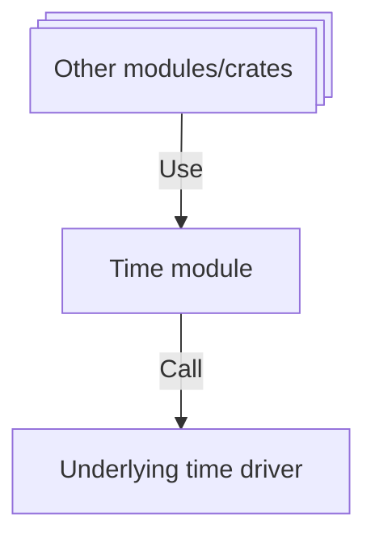

# 🕓 Time

The Time module provides the global time service used by Xila components.

It wraps a platform time device and exposes a singleton manager used to query the current time and uptime since startup.

## Features

The Time module includes the following features:

- **Current time retrieval**: Reads current time from the underlying time device.
- **Uptime computation**: Computes elapsed duration since module initialization.
- **Hardware abstraction**: Uses a common device interface, independent from platform internals.
- **Global singleton access**: Centralized manager (`initialize`/`get_instance`) shared across modules.

## Dependencies

The Time module relies on a platform-specific direct character device that returns a `Duration` payload.

## Architecture

The module stores a startup timestamp when initialized, then uses the same device to read current time and compute `current - startup` for uptime.

```mermaid
graph TD
    A@{ shape: processes, label: "Other modules/crates" }
    A -->|Use| B[Time module]
    B -->|Call| Underlying_time_driver[Underlying time driver]
```

## Initialization flow

1. Provide a platform implementation of `DirectCharacterDevice` that returns a `Duration` payload on read.
2. Call `time::initialize(driver)` once during system startup.
3. Access the singleton with `time::get_instance()`.

## API snapshot

- `time::initialize(...)`: Registers the global manager.
- `time::get_instance()`: Returns the initialized singleton manager.
- `Manager::get_current_time()`: Returns current time from the underlying device.
- `Manager::get_current_time_since_startup()`: Returns elapsed duration since initialization.

## Known limitations

- The current API is read-oriented: it does not provide direct time setting.
- Accuracy and monotonicity depend on the underlying driver implementation.
- Time zone management is intentionally out of scope at this level.

## Future improvements

Planned enhancements for the Time module include:

- **Network Time Protocol (NTP)**: Integration of NTP client support to synchronize system time with external time servers for high precision.
- **Optional wall-clock source policy**: clearer selection/fallback strategy when multiple time sources are available.

## References

- <HostReference crate="time" />

## See also

- [Drivers](../drivers.md)
- [Synchronization](../crates/synchronization.md)
