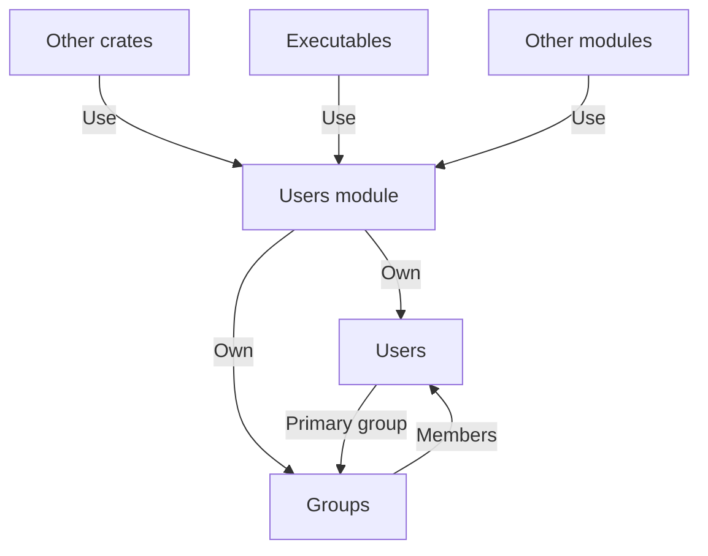

# 🧑 Users

The **Users** module manages user accounts and permissions within the Xila operating system, providing core functionality for creating, deleting, and managing users and groups.

To facilitate architectural modularity and avoid circular dependencies (specifically with the virtual file system), this module does not handle authentication or user sessions directly. These higher-level functionalities are implemented in the [Authentication](../crates/authentication.md) wrapper.

## Features

The Users module functions as a relational database for users and groups, offering the following features:

- **User and Group Management**: Capabilities to create, delete, and modify users and their associated groups.

## Dependencies

The Users module relies on the following crates:

- [Synchronization](../crates/synchronization.md): Ensures thread-safe operations within the module.

## Architecture

The Users module maintains an in-memory database of users and groups, along with their associated permissions. It provides an API for other modules to interact with user data.

Users and Groups are manipulated using unique identifiers. These identifiers are defined as half-register size integers (e.g., on a 32-bit system, they are 16-bit integers).

The identifier `0` is reserved for the **root** user and group, which holds all permissions.

## Known limitations

The Users module currently has the following limitations:

- **In-memory storage**: All user and group data is stored exclusively in memory. There is no offloading to persistent storage, which may limit scalability on systems with a very large number of users or groups.

## Future improvements

Nothing planned at the moment.

## References

- <HostReference path="users/index.html" text="Users" />

## See also

- [Authentication (crate)](../crates/authentication.md)
