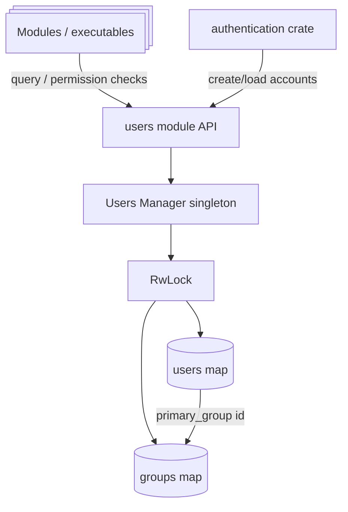

# 🧑 Users

The Users module is Xila's in-memory identity and group membership registry.

## Role in system

- Supplies user/group identity data for permission checks and ownership metadata.
- Allocates and resolves typed identifiers used by task and VFS layers.
- Guarantees root account/group bootstrap at manager initialization.

## Responsibilities and boundaries

**In scope**

- User/group insertion and lookup.
- Membership tracking (`add_to_group`, `is_in_group`, `get_user_groups`).
- Identifier and name resolution APIs.

**Out of scope**

- Credential verification policy (current `check_credentials` is placeholder-like).
- Authentication/session/token management.
- Persistent storage (state is runtime memory only).

## Internal architecture

- Singleton manager via `initialize()` and `get_instance()`.
- Internal `RwLock` protects:
  - `users: BTreeMap<UserIdentifier, InternalUser>`,
  - `groups: BTreeMap<GroupIdentifier, InternalGroup>`.
- `InternalUser` stores name + primary group.
- `InternalGroup` stores group name + membership set (`BTreeSet<UserIdentifier>`).

**Contract vs implementation**

- **Contract**: typed identifier APIs and membership/name lookup behavior.
- **Implementation**: exact map/set layout, root bootstrap details, allocation scan strategy.

```mermaid
graph TD
    Clients@{ shape: processes, label: "Modules / executables" }
    Auth[authentication crate]
    UsersAPI[users module API]
    Manager[Users Manager singleton]
    Lock[RwLock]
    UsersMap[(users map)]
    GroupsMap[(groups map)]

    Clients -->|query / permission checks| UsersAPI
    Auth -->|create/load accounts| UsersAPI
    UsersAPI --> Manager
    Manager --> Lock
    Lock --> UsersMap
    Lock --> GroupsMap
    UsersMap -->|primary_group id| GroupsMap
```

## Lifecycle and execution model

1. Initialize manager once; root user/group are inserted immediately.
2. Allocate identifiers for additional users/groups.
3. Register users/groups and membership before launching constrained workloads.
4. Query identity/membership during runtime from task/VFS policy paths.

## Data/control flow

- Task metadata uses user/group identifiers from this module.
- VFS permission checks call `users::is_in_group(...)` during access control.
- Name-based resolution provides bridge between human-readable config and typed runtime ids.

## Concurrency and synchronization model

- Single `RwLock` guards all user/group data.
- Read operations scale concurrently.
- Mutating operations (add user/group/member) take write lock and enforce duplicate checks.

## Dependency model

- Used directly by [Task](./task.md) and [Virtual file system](./virtual_file_system.md).
- Higher-level authentication crate composes over this module rather than embedding inside it.

## Failure semantics and recovery behavior

- Duplicate identifiers/names return explicit duplicate errors.
- Invalid user/group references return typed invalid-identifier errors.
- Identifier allocation fails with `TooManyUsers` / `TooManyGroups` on range exhaustion.

## Extension points

- Add richer metadata per user/group while preserving typed id model.
- Add batch APIs for provisioning workflows.
- Add persistent snapshot/load layers in higher-level components.

## Known limitations and trade-offs

- Runtime-only storage; no built-in persistence.
- Current credential-check method is not a complete authentication implementation.
- Simplicity of global manager trades off horizontal sharding/partitioning.

## References / See also

- <HostReference crate="users" />
- [Authentication (crate)](../crates/authentication.md)
