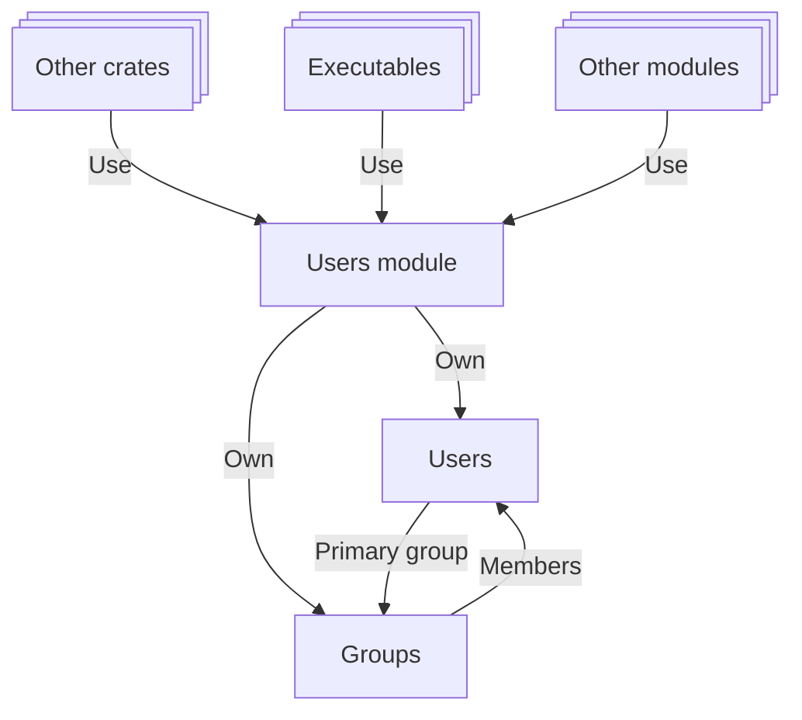

# 🧑 Users

The **Users** module manages user accounts and permissions within the Xila operating system, providing core functionality for creating, deleting, and managing users and groups.

To facilitate architectural modularity and avoid circular dependencies (specifically with the virtual file system), this module does not handle authentication or user sessions directly. These higher-level functionalities are implemented in the [Authentication](../crates/authentication.md) wrapper.

## Features

The Users module functions as a relational database for users and groups, offering the following features:

- **User and Group Management**: Capabilities to create, delete, and modify users and their associated groups.
- **Identifier allocation**: Generates non-conflicting user/group identifiers.
- **Membership queries**: Supports checking group membership and listing user groups.
- **Name/identifier resolution**: Converts between names and identifiers.
- **Root bootstrap**: Automatically initializes root user and root group.

## Dependencies

The Users module relies on the following crates:

- [🔃 Synchronization](../crates/synchronization.md): Ensures thread-safe concurrent access via an internal `RwLock`.

## Architecture

The Users module stores internal user/group maps and exposes async methods to read/update them safely.

```mermaid
graph TD
    Other_crates@{ shape: processes, label: "Other crates" }
    Executables@{ shape: processes, label: "Executables" }
    Other_modules@{ shape: processes, label: "Other modules" }
    Users_module[Users module]
    Users[Users]
    Groups[Groups]

    Other_crates -->|Use| Users_module
    Executables -->|Use| Users_module
    Other_modules -->|Use| Users_module
    Users_module -->|Own| Users
    Users_module -->|Own| Groups

    Users -->|Primary group| Groups
    Groups -->|Members| Users


```

Users and Groups are manipulated using typed identifiers (`UserIdentifier`, `GroupIdentifier`).

Both are currently backed by `u16`, with `0` reserved for `root` and non-root allocations starting at `1`.

The identifier `0` is reserved for the **root** user and group, which holds all permissions.

## Known limitations

The Users module currently has the following limitations:

- **In-memory storage**: User and group state is runtime-only unless persisted by higher-level crates.
- **Credential checks delegated elsewhere**: Authentication/credential persistence are intentionally handled outside this module.

## Future improvements

- Incremental APIs for batch/group operations.
- Optional richer metadata attached to users and groups.

## References

- <HostReference crate="users" />

## See also

- [Authentication (crate)](../crates/authentication.md)
