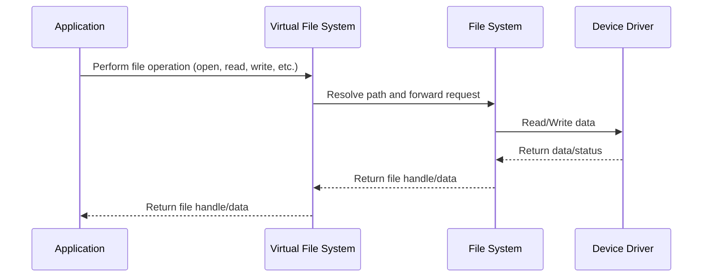

# 🗃️ Virtual file system

Xila provides a file system API that allows to manage files, directories, and devices in a unified way, following the Unix philosophy "everything is a file".

## Features

The virtual file system module offers the following features:

- **Unified API**: Manage files, directories, and devices through a consistent interface.
- **Multiple file types**: Support for regular files, directories, block devices, character devices, and pipes.
- **Extensible design**: Ability to mount multiple file systems with custom implementations.
- **Unix-like semantics**: Familiar file operations and permissions model.
- **Thread-safe operations**: Concurrent access to the file system with proper synchronization.

## Dependencies

The virtual file system module depends on the following modules:

- [Time](./time.md): Used for file timestamps.
- [Users](./users.md): Used for file ownership and permissions.
- [Task](./task.md): Used to get the current task context for file operations.

It also relies on the following crates:

- [alloc](https://doc.rust-lang.org/alloc/): Used for dynamic memory allocation.

## Architecture

The virtual file system acts as an abstraction layer between applications and concrete file system implementations, allowing multiple file systems to be mounted at different paths.

### File types

Xila supports the following file types:

- **File**: A file is a sequence of bytes that can be read and written in an underlying file system.
- **Directory**: A directory is a file that contains a list of files and directories inside it in an underlying file system.
- **Block device**: A block device is a file that allows reading and writing of data in blocks in an underlying file system.
- **Character device**: A character device is a file that allows reading and writing of data one character at a time in an underlying file system.
- **Pipe**: A pipe is a file that allows inter-process communication.

### File system implementation

Xila virtual file system is designed to be extensible and mount multiple file systems.
A file system can be implemented through the <HostReference crate="file_system" kind="trait" symbol="FileSystemOperations" />.

Currently, Xila provides the following file systems:

- [`Little FS`](../crates/little_fs.md): A lightweight file system designed for embedded systems.

Once a file system is implemented, it can be mounted to a specific path.

### Operation flow

Here is the working principle of the virtual file system:

### File system structure

- `/`: Root directory
  - `/binaries`: Executable files
  - `/configuration`: Configuration files (user space)
    - `/shared`: Shared configuration files (e.g. )
  - `/data`: Application data files (user space)
    - `/shared`: Shared data files (e.g. logs)
  - `/devices`: Mounted devices
  - `/logs`: System and application logs
  - `/system`: System files (kernel space)
    - `/groups`: Group definitions
    - `/users`: User definitions
  - `/temporary`: Temporary files (cleared on reboot)

## Known limitations

The virtual file system module has the following known limitations:

- **Limited file system support**: Currently only Little FS is implemented.
- **No symbolic links**: Symbolic links are not yet supported.
- **No file locking**: File locking mechanisms are not implemented.

## Future improvements

Planned future improvements for the virtual file system module include:

- **Additional file systems**: Support for FAT32, ext4, and other common file systems.
- **Symbolic links**: Add support for soft and hard links.
- **File locking**: Implement advisory and mandatory file locking.
- **Extended attributes**: Support for extended file attributes and metadata.
- **File watching**: Notification system for file system changes.

## References

- <HostReference crate="virtual_file_system" />

## See also

- [Little FS official documentation](https://github.com/littlefs-project/littlefs)
- [POSIX file system standards](https://pubs.opengroup.org/onlinepubs/9699919799/)
