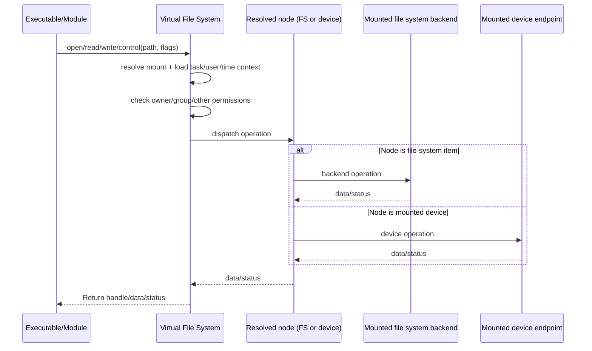

# 🗃️ Virtual file system

The Virtual File System (VFS) is Xila's path router and policy gate for file systems, devices, and pipes. It maps absolute paths to mounted backends, applies ownership/permission checks, and returns typed handles (`File`, `Directory`) for subsequent operations.

## Role in system

- Provides the global namespace used by modules and executables (`/`, `/devices`, `/system`, `/data`, ...).
- Normalizes access to heterogeneous backends: regular file systems, character devices, block devices, and named/unnamed pipes.
- Bridges module concerns: task identity (`task`), user/group policy (`users`), and timestamps (`time`).

## Responsibilities and boundaries

**In scope**

- Path-to-mount resolution (longest-prefix mount selection).
- Permission and ownership enforcement before backend calls.
- Mount/unmount lifecycle for file systems and devices.
- Handle-level dispatch for file, directory, and pipe operations.

**Out of scope**

- Concrete on-disk layout semantics (owned by mounted file-system implementations).
- Authentication/session policies (owned by higher-level components).
- Link semantics and advisory locking APIs (not implemented in this module).

## Internal architecture

- Singleton manager: `virtual_file_system::initialize(...)` stores one `VirtualFileSystem` in `OnceLock`.
- Core state (`RwLock`-protected):
  - `file_systems: Vec<InternalFileSystem>` (mount point + backend pointer + reference count),
  - `character_device: BTreeMap<Inode, InternalCharacterDevice>`,
  - `block_device: BTreeMap<Inode, InternalBlockDevice>`,
  - `pipes: BTreeMap<Inode, InternalPipe>`.
- Mount targets are represented as `ItemStatic` and materialized as `File`/`Directory` wrappers around synchronous primitives.
- Default hierarchy helper (`create_default_hierarchy`) creates and sets permissions on standard paths, including `/devices/network`.

## Lifecycle and execution model

1. Initialize `task`, `users`, and `time` managers.
2. Initialize VFS with root backend (`initialize(..., root_file_system)`).
3. Create the default hierarchy (`create_default_hierarchy`).
4. Mount optional file systems/devices (`mount_file_system`, `mount_character_device`, `mount_block_device`, `create_named_pipe`).
5. Use async APIs (`open`, `open_directory`, `create_directory`, `remove`, `rename`, ...).
6. Optionally unmount (`unmount`, `unmount_all`) and uninitialize backend ownership.

## Data/control flow

```mermaid
sequenceDiagram
  participant App as Executable/Module
  participant VFS as Virtual File System
  participant Node as Resolved node (FS or device)
  participant FS as Mounted file system backend
  participant Dev as Mounted device endpoint

  App->>VFS: open/read/write/control(path, flags)
  VFS->>VFS: resolve mount + load task/user/time context
  VFS->>VFS: check owner/group/other permissions
  VFS->>Node: dispatch operation
  alt Node is file-system item
    Node->>FS: backend operation
    FS-->>Node: data/status
  else Node is mounted device
    Node->>Dev: device operation
    Dev-->>Node: data/status
  end
  Node-->>VFS: data/status
  VFS-->>App: Return handle/data/status
```

## Concurrency and synchronization model

- Global state uses `RwLock<CriticalSectionRawMutex, ...>`.
- Open/close paths update per-mount or per-device reference counters to protect unmount semantics.
- Busy resources are surfaced as `RessourceBusy`/`file_system::Error::RessourceBusy`.
- `poll(...)` retries busy operations with `task::yield_now().await`.
- `blocking_operation(...)` enforces non-blocking file-state behavior by returning busy errors directly when `StateFlags::NonBlocking` is set.

## Dependency model

- `task`: current task identifier and owner metadata lookup.
- `users`: group membership checks for permission evaluation.
- `time`: timestamp stamping for create/access/modify/status updates.
- `file_system` traits: backend contracts (`FileSystemOperations`, `CharacterDevice`, `BlockDevice`).

## Failure semantics and recovery behavior

- Invalid path/mount conditions return `Error::InvalidPath`.
- Missing metadata fields (`kind`, `inode`, `permissions`, ...) return `Error::MissingAttribute`.
- Permission failures return `Error::PermissionDenied` before backend execution.
- Unmount with live references returns `Error::RessourceBusy` unless `force` is requested.
- Device cleanup helpers (`clean_devices*`) tolerate expected stale references (`InvalidIdentifier`) to make startup idempotent.

## Extension points

- New file systems: implement <HostReference crate="file_system" kind="trait" symbol="FileSystemOperations" /> and mount them.
- New devices: implement direct character/block traits and mount into namespace paths.
- Named/unnamed pipes: provided as built-in in-memory FIFO endpoints.

## Known limitations and trade-offs

- Symbolic link and file-locking APIs are not implemented in the current surface.
- Several ABI-level filesystem calls are still `todo!()` (for example symlink/time-setting/truncate paths), so C surface completeness is lower than internal Rust API completeness.
- Shared global manager simplifies integration but centralizes contention on VFS metadata locks.

## Contract vs implementation

- **Stable module contract:** A global path namespace with mount-based dispatch, ownership/permission checks, and typed file/directory/pipe operations surfaced through the module API.
- **Current implementation details:** A singleton manager backed by `OnceLock` + `RwLock`, in-memory mount/device registries, helper-generated default hierarchy, and specific lock/reference-count strategies used to enforce unmount safety.
- **Compatibility note:** Consumers should depend on API semantics and error behavior, not on concrete internal collections, locking structure, or initialization helper internals, which can evolve without changing the public contract.

## Reference namespace layout

- `/`: Root directory
  - `/binaries`: Executable files
  - `/configuration`: Configuration files (user space)
    - `/shared`: Shared configuration files (e.g. network profiles)
  - `/data`: Application data files (user space)
    - `/shared`: Shared data files (e.g. logs)
  - `/devices`: Mounted devices
  - `/logs`: System and application logs
  - `/system`: System files (kernel space)
    - `/groups`: Group definitions
    - `/users`: User definitions
  - `/temporary`: Temporary files (cleared on reboot)

## References / See also

- <HostReference crate="virtual_file_system" />
- [Network module](./network.md)
- [Task](./task.md)
- [Users](./users.md)
