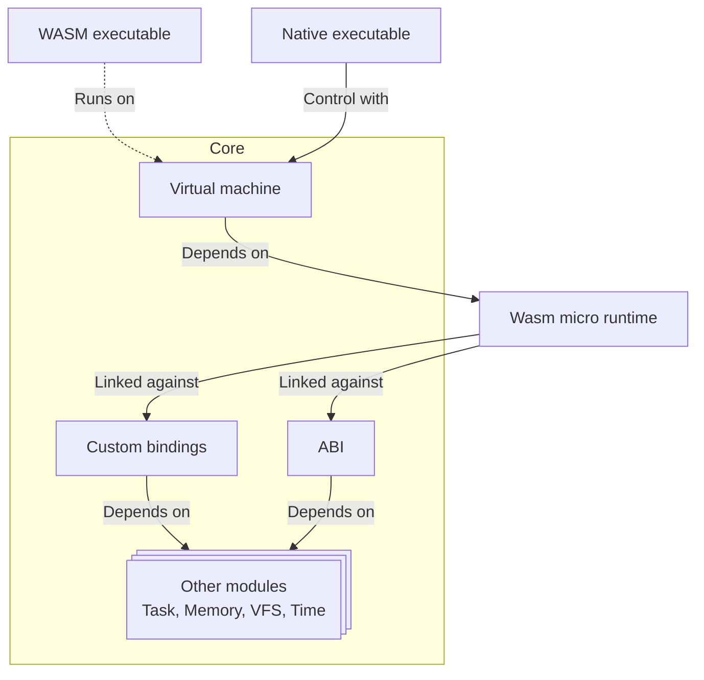

# 🖥️ Virtual machine

One of Xila's core capabilities is executing applications on systems with restricted or read-only program memory.

To achieve this, Xila integrates a Virtual Machine (VM) module capable of interpreting and executing WebAssembly (WASM) bytecode.

This module provides a runtime environment for WASM applications, enabling them to run on Xila regardless of the underlying hardware architecture. Consequently, applications can be developed for a broad spectrum of devices, ranging from embedded systems to desktop computers.

## Features

The virtual machine module offers the following features:

- **WASM support**: Ability to execute WebAssembly bytecode.
- **Sandboxed environment**: Applications run in a secure and isolated environment.
- **Cross-platform compatibility**: Applications can run on different hardware architectures without modification.
- **Integration with Xila modules**: Access to Xila's services and functionalities through WASI or custom bindings.
- **Dynamic loading**: Ability to load and execute WASM modules at runtime.

## Dependencies

The virtual machine is powered by the [WebAssembly Micro Runtime (WAMR)](https://github.com/bytecodealliance/wasm-micro-runtime), a lightweight runtime optimized for embedded systems. Integration is achieved via the [wamr-rust-sdk](https://github.com/AlixANNERAUD/wamr-rust-sdk), which provides the necessary Rust bindings for WAMR.

The virtual machine module depends on the following modules:

- [Task](./task.md): Used to manage the execution context of WASM applications.
- [Memory](./memory.md): Used to handle memory allocation for WASM applications.
- [Virtual file system](./virtual_file_system.md): Used to provide file system access to WASM applications.
- [Time](./time.md): Used to provide time-related functionalities to WASM applications.
- [ABI](./abi.md): Used to define the interface between WASM applications and Xila modules.

It also relies on the following internal crates:

- [Synchronization](https://doc.rust-lang.org/std/sync/): Used for thread-safe operations within the VM.
- [Shared](../crates/shared.md): Provides common utilities and types used across Xila modules.

## Architecture

Here is a brief explanation of the architecture components:

1. **WASM executable**: An application compiled into WebAssembly bytecode (targeting `wasm32-unknown-unknown` or `wasm32-wasi`).
2. **Native executable**: A native application that loads from the virtual file system and orchestrates the virtual machine to execute WASM applications.
3. **Virtual machine**: The core module that manages the execution lifecycle of WASM applications using WAMR.
4. **WebAssembly Micro Runtime (WAMR)**: The lightweight runtime engine responsible for executing the WASM bytecode.
5. **ABI**: The Application Binary Interface layer which ensures compatibility for standard WASI calls when the WASM application invokes system services.
6. **Custom bindings**: Interfaces for Xila-specific functionalities not covered by WASI, allowing WASM applications to access services such as graphics and networking.
7. **Other modules**: Both the ABI and custom bindings act as secure proxies (performing necessary translation and enforcing sandboxing, such as restricting direct memory access) to interact with other Xila modules like Task, Memory, Virtual File System, and Time.

## Known limitations

The virtual machine module has the following known limitations:

- **Performance overhead**: Running applications in a virtual machine introduces some performance overhead compared to native execution.
- **Limited access to hardware**: WASM applications have restricted access to hardware resources, which may limit their capabilities.
- **WASM feature support**: Not all WebAssembly features may be supported by the WAMR runtime.

## Future improvements

Planned future improvements for the virtual machine module include:

- **Extended WASI Support**: Currently, only `wasi_snapshot_preview1` is supported, it would be beneficial to implement add support for `wasi_snapshot_preview2` which would offer out-of-the-box networking capabilities.

## References

- <HostReference path="virtual_machine/index.html" text="Virtual machine" />

## See also

- [ABI](./abi.md)
- [Bindings](./bindings.md)
