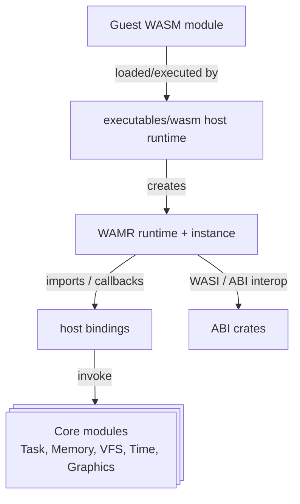

# 🖥️ Virtual machine

Xila's WebAssembly runtime integration is implemented in the WASM executable host path and built on WAMR.

## Role in system

- Loads and executes guest WASM modules under host-managed runtime instances.
- Connects guest imports to host callbacks via registrable binding providers.
- Bridges guest stdio and file-context state into Xila ABI/VFS services.

## Responsibilities and boundaries

**In scope**

- Runtime creation and host function registration.
- Module loading from byte buffers and WASI argument setup.
- Instance creation and exported function invocation.
- Execution-time ABI context setup for task/file identifiers.

**Out of scope**

- Defining all host API contracts (split across [ABI](./abi.md) and [Bindings](./bindings.md)).
- Generic process supervision outside the WASM execution path.

## Internal architecture

- Runtime layer (`runtime.rs`): WAMR runtime builder + registration of `Registrable` host function descriptors.
- Module layer (`module.rs`): converts WASM bytes to WAMR module, injects WASI args/env/stdin/out/err.
- Instance layer (`instance.rs`): creates callable module instance and manages custom-data lifecycle.
- Environment/translation layers (`environment.rs`, `translation.rs`, `custom_data.rs`): pointer translation and host-object mapping.

**Contract vs implementation**

- **Contract**: `Runtime::execute(...)` and guest import signatures/types (`WasmPointer`, `WasmUsize`).
- **Implementation**: WAMR-specific setup calls, custom data map mechanics, and exact WASI argument plumbing.

```mermaid
graph TB
    GuestWasm[Guest WASM module]
    HostExec[executables/wasm host runtime]
    WAMR[WAMR runtime + instance]
    HostBindings[host bindings]
    ABI[ABI crates]
    CoreModules@{ shape: processes, label: "Core modules<br/>Task, Memory, VFS, Time, Graphics" }

    GuestWasm -->|loaded/executed by| HostExec
    HostExec -->|creates| WAMR
    WAMR -->|imports / callbacks| HostBindings
    HostBindings -->|invoke| CoreModules
    WAMR -->|WASI / ABI interop| ABI
```

## Lifecycle and execution model

1. Build runtime with selected registrables.
2. Resolve task/environment and register stdio files in ABI context.
3. Load module from bytes and set WASI args/env.
4. Instantiate module with configured stack size.
5. Invoke exported function and collect return values.
6. Drop instance/module and clear temporary custom/context state.

## Data/control flow

- `Runtime::execute` orchestrates ABI context binding, module creation, instance invocation, and result propagation.
- Host callbacks use VM environment translation APIs to map guest addresses to host pointers or host-object ids.
- Bindings/ABI calls re-enter core services through controlled boundaries.

## Concurrency and synchronization model

- `Runtime` and `Instance` are marked `Send`/`Sync` in this integration layer.
- ABI context task binding around calls is explicit (`call_abi`) to keep per-call task association coherent.
- Downstream synchronization is delegated to called modules (graphics lock, VFS locks, task manager locks).

## Dependency model

- Depends on WAMR runtime crate and generated/handwritten host bindings.
- Depends on [ABI](./abi.md) for WASI-like/system-level calls and file descriptor context.
- Depends on [Task](./task.md), [Virtual file system](./virtual_file_system.md), and other core modules through bindings.

## Failure semantics and recovery behavior

- Runtime/module/instance creation failures are surfaced as VM `Error` variants.
- File-context registration failures abort execution before guest call.
- Translation failures in host callbacks return binding/VM errors back to guest boundary.

## Extension points

- Register additional `Registrable` providers for new host import families.
- Add new translation adapters for custom guest-host object types.
- Extend execution wrappers for additional runtime policies (quotas, tracing, profiling).

## Known limitations and trade-offs

- Runtime integration currently lives in executable layer, not as a standalone Core module crate.
- Supported WASI surface is constrained by current integration choices.
- Guest execution overhead and hardware access constraints are intrinsic to sandbox model.

## References / See also

- <HostReference crate="virtual_machine" />
- [ABI](./abi.md)
- [Bindings](./bindings.md)
